We'll examine an inherent conflict of data visualizations (especially where this class is concerned) and then get our hands dirty with some basic charts in R and D3.
###Quick links
<a href="#r-console">R console</a>
<a href="#r-charts">R charts</a>
<a href="#javascript-console">JS console</a>
<a href="#d3-chart">D3 charts</a>

##Housekeeping

Going over some things that we might have missed in the first class: preferred email addresses, clss Google group, how to email us, office hours, classroom behavior, what our starting skills are (and why that's hard), open questions.

<h4>Who's here</h4>
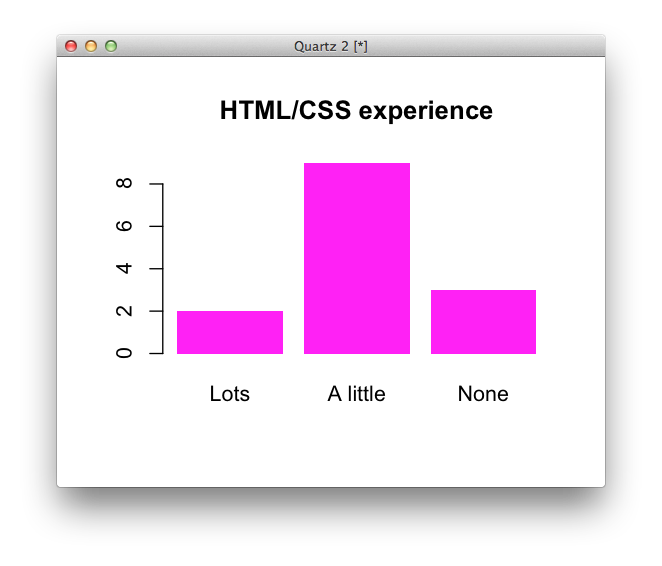
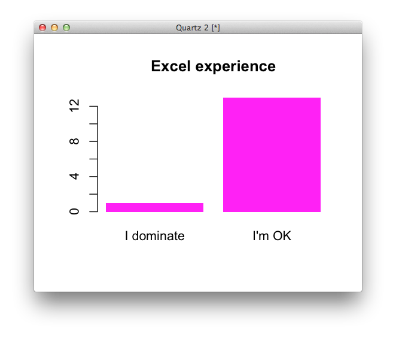
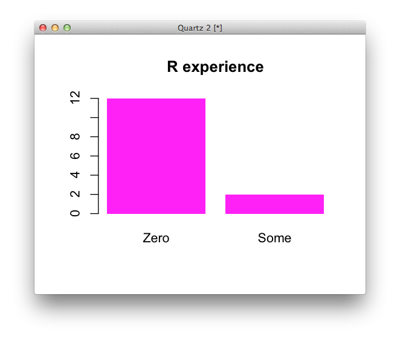
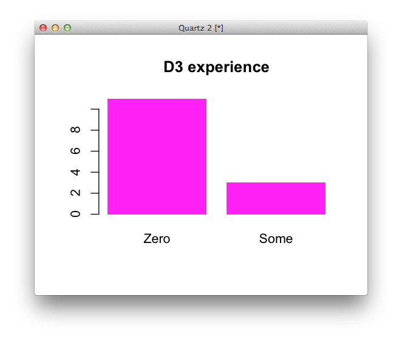

##Critique

Shan and Kevin (Shavin) will give an example of the kind of critique we'll be expecting you to do in subsequent classes. Details are on the class home page. They'll be discussing <a href="http://www.nytimes.com/interactive/2009/02/02/sports/20090202_superbowl_twitter.html?_r=0">one of the first "journalistic" Twitter maps</a>, which they both worked on, sort of. On your own time, you might or might not read <a href="http://source.mozillaopennews.org/en-US/learning/perils-polling-twitter/">this article by Jake Harris</a> about problems using Twitter data.

##Lecture

<a href="lecture.html">The essence vs. the fiddly bits of data graphics, and understanding chart types</a>.

##Lab

We'll make some bar charts with R and D3, but mostly we'll get familiar with the console and environments of each. We'll be replicating Kevin’s <a href="http://www.nytimes.com/2013/08/27/sports/ncaafootball/to-defend-its-empire-espn-stays-on-offensive.html#g-histogram">favorite bar chart</a> of 2013.

<h4>Creating a new project</h4>

Let’s review a bit and create a new repo in github for our project. Previously we created the repo on the github website, but today we’ll use the app

<ol class="steps">
  <li>
    
Create a new repo with the github “cat” app. There’s a plus button at the bottom of the screen that will allow you to add a new repo.

    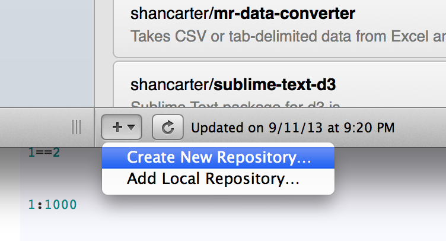
  </li>
  <li>
    
Name it “bar-chart” and save it in the “dataviz-fall-2013” folder.

    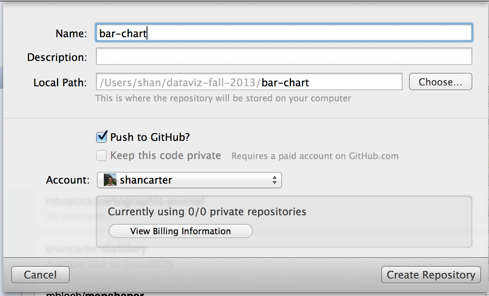
  </li>
</ol>
<h4 id="r-console">Getting started with the R console</h4>

R isn't hard, but it can feel difficult because it's picky. The difference between a map or chart that works and one that's broken can sometimes just be a missing argument to a method (like <code>stringsAsFactors=F</code> or <code>horiz=T</code>), which can be frustrating. Rather than try to cover all of these exhaustively, we'll just start making some projects and learn as we go.

<ol class="steps">
  <li>
    
You should have R or RStudio installed on your machine or desktop. If you don't, <a href="http://cran.r-project.org/">install it</a> and run it form the applications menu. You should see the R console, which looks like this:

  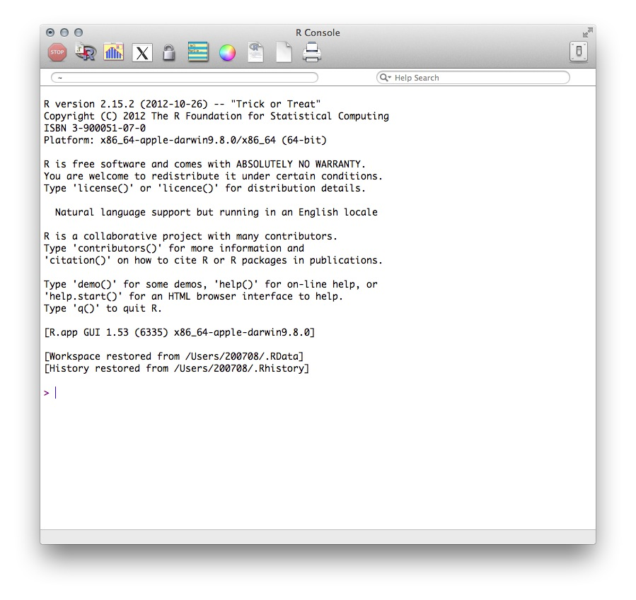
  
If you have RStudio instead of this basic R console, that's fine too. Each has its merits.

  
  </li>
  <li>
    
Inside your <code>bar-charts</code> folder, make a new file called <code>tutorials.R</code> in a text editor and save it. Start by typing your working directory in your R text file and pasting it into the R console.

    <pre><code class="language-r">setwd("~/dataviz-fall-2013/bar-chart") #or wherever you're keeping your code</code></pre>
  </li>
  <li>
    
Start typing things into the console and discuss what happens after each.

  <pre>
    <code class="language-r">"I should exercise more."

1+1

1==2

1:1000

animals <- c("bears","monkeys","donkeys")

animals[1]

class(animals)

class(1==2)

class(1:1000)

</code>
</pre>
</li>
</ol>

<h4 id="r-charts">Making a bar chart in R</h4>
<ol class="steps">
  <li>The thing we need for any chart is data. Download <a href="subscription-prices.csv">this CSV</a> of the cost of various cable channels per subscriber per month. Save it to your local project folder. (PS, do you know what a CSV is?)
    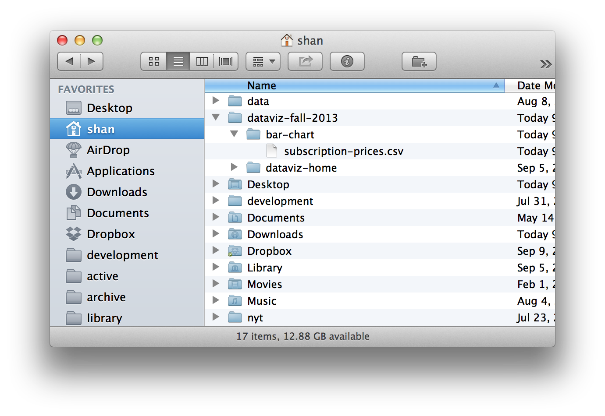
  </li>
  <li>Load the file under the variable name <code>prices</code>
  <pre>
    <code class="language-r">prices <- read.csv("subscription-prices.csv")</code>
  </pre>
  </li>

  <li>Let's try a few things, one at a time, and discuss:
  <pre>
<code class="language-r">class(prices)
dim(prices)
head(prices)
head(prices, n=20)
names(prices)
prices$X2013
prices$X2013[1:10]
class(prices$X2013)
?head
prices[1,]
prices[,1]
prices[,c("Network")]
prices[1:10,c("Network")]</code>

  </pre>
  </li>

  <li>
    Before we make any charts, let's get to know our data. How many rows does it have? How many columns? What are other meaningful questions we could ask (or should probably know the answer to)?
  </li>

  <li>
    Let's see what a basic plot of the prices looks like.
    <pre>
      <code>plot(prices$X2013)</code>
    </pre>
    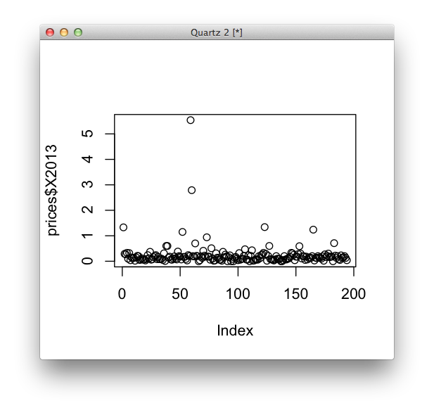
    We only gave it one vector to plot, but it's plotting on both X and Y coordinates. What does the X axis represent here? What does one dot represent?
  </li>

  <li>
    That chart isn't so fun. What order is our data in? Let's sort our data frame in order from highest price to lowest. (This isn't the most fun to write, but we resort a lot in R, so you this code will come in handy later.)
    <pre>
      <code class="language-r">prices <- prices[order(prices$X2013, decreasing=T),]</code>
    </pre>
  </li>

  <li>
    Now let's do the same plot as before.
    <pre>
      <code>plot(prices$X2013)</code>
    </pre>
    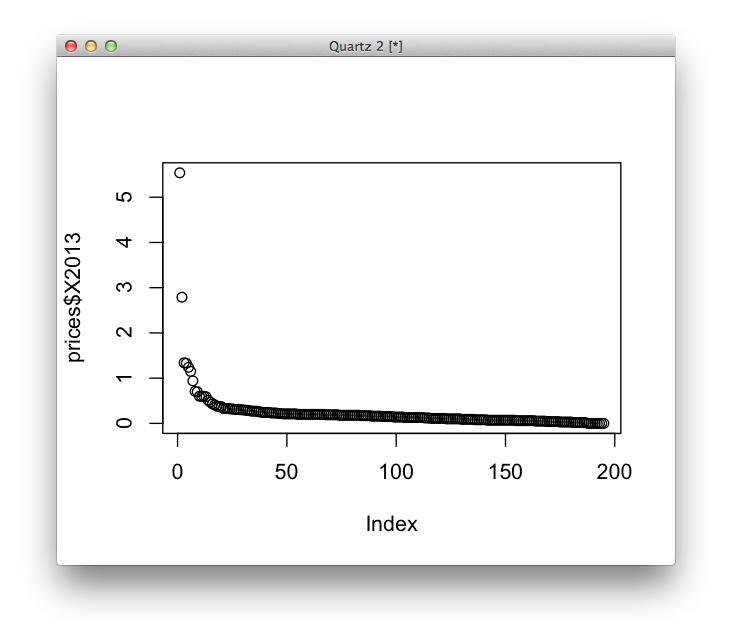
  </li>

  <li>Try a different kind of plot (one R is kind of annoying about, actually).
  <pre>
    <code>barplot(prices$X2013)</code>
  </pre>
  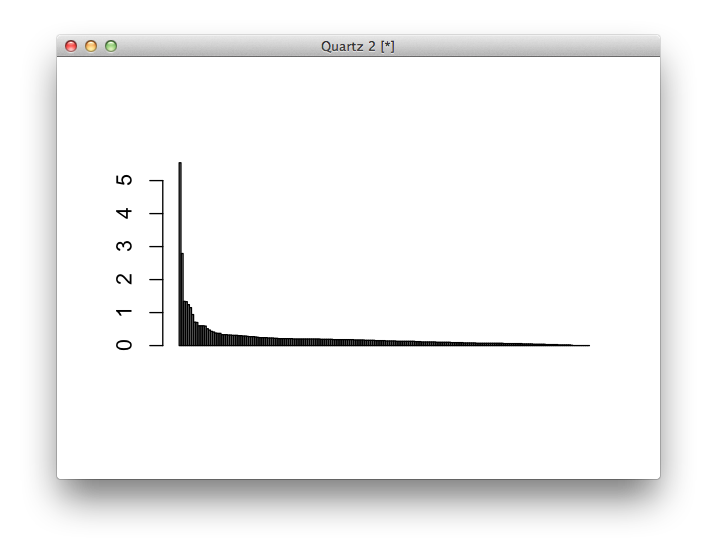
    Note the difference here in the X axis. Which plot do you prefer?
  </li>

  <li>Note that you can give all sorts of arguments to the plot commands. Take a look through the docs with <code>?plot</code>. Here's the same plot as before, but with some extra arguments.
  <pre>
    <code>barplot(prices$X2013, col="lightgrey", border=F, main="Total control!", ylab="Price")</code>
  </pre>
  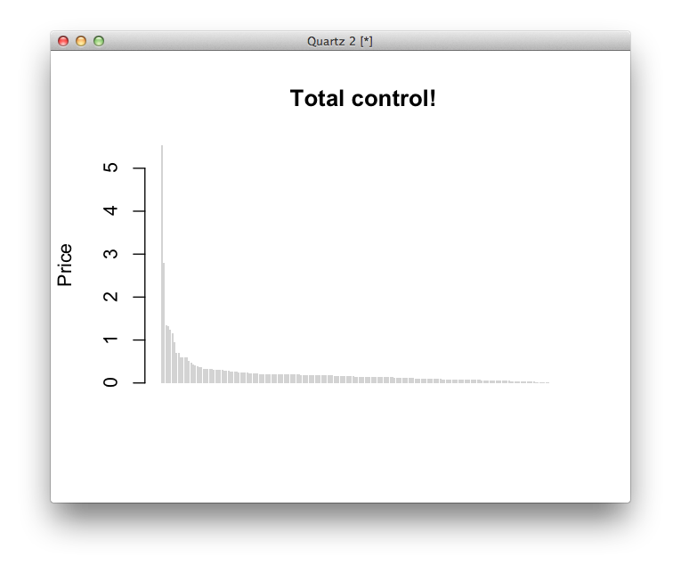
  </li>

  <li>Let's do a little logic and sorting, then replot.
  <pre>
    <code class="language-r">#sorting
prices <- prices[order(prices$X2013),]
barcolors <- ifelse(prices$Network == "ESPN", "red", "lightgrey")
barplot(prices$X2013, col=barcolors, border=F, main="Now with custom colors!", ylab="Price")</code>
  </pre>
  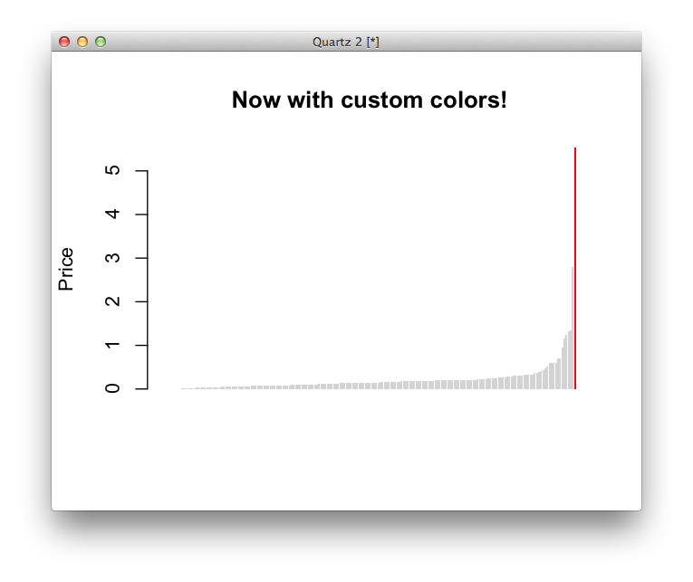
  That's it! You made your first data visualization in R. It's not the best, but it's only about three lines of code. In a hurry, you could post this online very quickly – Nate Silver probably would too. But it's static and inflexible – what if you wanted users to be able to look up any station, or resize the chart based on which device a user was coming from? For increased flexibility, you might want to draw this chart in a web browser.
  </li>
  <li>
    
If you want to learn more about any of the commands we ran, R has a convention for brining up the documentation of any method.

    <pre><code>#? then the name of the method
?plot
?barplot
##or, if you want fuzzy matching, try this
help.search("bar plot")
    </code></pre>
  </li>

</ol>

<h4 id="javascript-console">Getting started with the Javascript console</h4>

<ol class="steps">
  <li>
    
Close your R files for now and create a blank HTML page like the one described by Scott Murray in his <a href="http://alignedleft.com/tutorials/d3/setup">great D3 tutorial</a>. You can download that file <a href="0-d3.html">right here</a>, but make sure you save it (by right clicking on the link and choosing “Save Link As...”) to your local directory. Name the file <code>index.html</code>.

    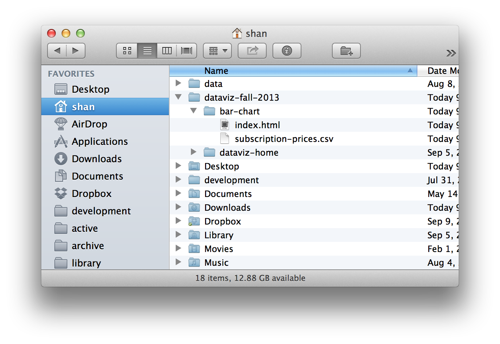
  </li>
  <li>
    
Before we start coding, let's get set up in the Terminal by starting a server on port 8000 using Python’s <a href="http://docs.python.org/2/library/simplehttpserver.html">SimpleHTTPServer</a>. To do this, open the terminal app, and then navigate to the folder that contains your empty html page by typing the following command.

    <pre><code>cd ~/dataviz-fall-2013/bar-chart/</code></pre>
    
Then type:

    <pre><code>python -m SimpleHTTPServer</code></pre>
    
This sets up a simple server to mimic the real world internet so your browsers doesn’t barf when you try to do stuff.

    
Now we're ready to start coding. Your <code>index.html</code> file is now accessible by going to <a href="http://localhost:8000">localhost:8000</a> in your web browser.

  </li>
  <li>
    
Open your <code>index.html</code> page (which might be blank, which is fine) and open the Console. (View > Developer > Javascript Console.) Type <code>d3</code> in the console and see what you get. You should get a response that says you loaded D3 successfully.

    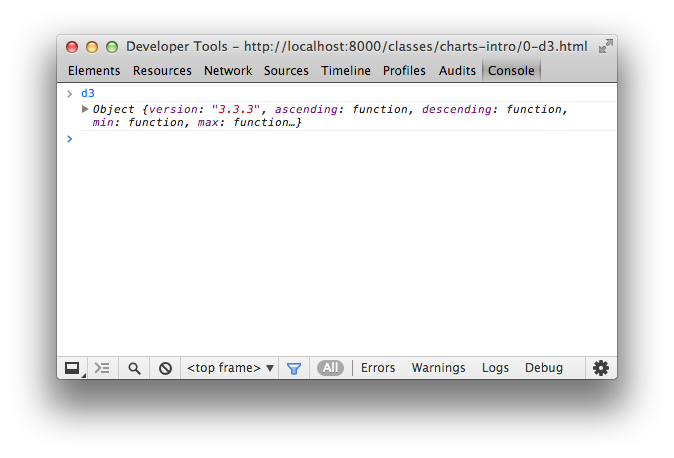
  </li>
  <li>
    
Let's try typing the same things we did with R earlier, and note the small differences.

    <pre><code>"I should exercise more."

1+1

1==2

1:1000 // doesn't work

animals = ["bears","monkeys","donkeys"] // new array syntax

animals[1] //note zero-based

typeof animals //not "class"

typeof (1 === 2)

    </code></pre>
    
The Javascript Console is going to be one of our best ways to inspect and debug the HTML, CSS and Javascript we write. The sooner you get comfortable with it, the better.

  </li>

<!-- <h4>Making a bar chart in D3</h4> -->

  <li>
    
Inside your script tag, let's write some Javascript using D3. First, let's add a headline:

    <pre><code class="language-javascript">d3.select("body").append("h1").text("My first bar chart")</code></pre>
    
What just happened?

  </li>
  <li>
    
Now let's add an SVG element to the page with the <a href="http://bl.ocks.org/mbostock/3019563">margin conventions</a> described by Mike Bostock, the creator of D3. Basically, this code tells your browser to draw a big box (an SVG element) on the page. We're going to draw a chart inside this box. The <code>margin</code> stuff seems confusing at first, but these are the fiddly bits Hadley is describing, so if we want to learn D3, we need to do the fiddly stuff.

    <pre><code class="language-javascript">var margin = {top: 20, right: 10, bottom: 20, left: 10};

var width = 600 - margin.left - margin.right,
height = 250 - margin.top - margin.bottom;

var svg = d3.select("body").append("svg")
.attr("width", width + margin.left + margin.right)
.attr("height", height + margin.top + margin.bottom)
.append("g")
.attr("transform", "translate(" + margin.left + "," + margin.top + ")");
    </code></pre>
    
Use the Chrome inspector to see if your code worked. If it did, you should have an SVG element on your page.

  </li>
  <li>
    
Let's add a plain rectangle to the SVG element just to get used to the syntax.

    <pre><code class="language-javascript">var testRectangle = svg.append("rect")
.attr("x", 20)
.attr("y", 100)
.attr("height", 50)
.attr("width", 200)
.attr("class", "testbar");
  </code></pre>
    
Make a CSS block on the top of your <code>index.html</code> page to style your rectangle.

    <pre><code class="language-html">&lt;style type="text/css"&gt;
svg {
border: 2px solid orange;
}

.testbar {
fill: #ff00ff;
}
&lt;/style&gt

    </code></pre>
    
It might look like this. (Here's a <a href="1-d3.html">working page</a> if you want to take a look.)

    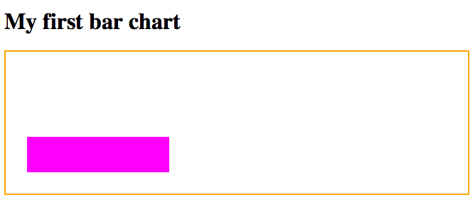
    
What do the x and y positions we set mean?

  </li>
  <li>
    
Obviously, this is just a random rectangle and we need it to be a bar chart that represents our data. Let's connect data to our document using D3.

  </li>
</ol>
<h4 id = "d3-chart">Making a bar chart in D3</h4>
<ol class="steps">
  <li>
    
To load your data, add this code:

    <pre><code>d3.csv("subscription-prices.csv", function(err, prices) {
      console.log(prices)
    });
    </code></pre>
    
Check out your Inspector. Did your data load correctly? If so, it might look like this:

    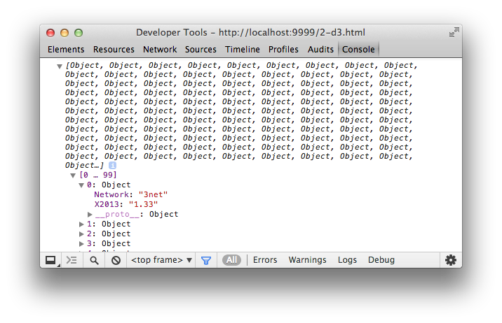
    
What is the data type of <code>X2013</code>? How might we fix it?

  </li>
  <li>
    
Before our <code>console.log</code> code, add this, which should help turn our data from a string into a number.

    <pre><code class="language-javascript">prices.forEach(function(d) {
// recasts d.2013 as a number, not a string
d.X2013 = +d.X2013;
})</code>
</pre>
Go back to the inspector and check out the difference. Why does this matter?
</li>

<li>We're now going to do one of the most powerful applications of D3: the data join. We're going to join the data we loaded to elements on the page. This is a little abstract, but it's described well in Scott Murray's <a href="http://alignedleft.com/tutorials/d3/binding-data">tutorial section</a> and more abstractly by the boss himself in <a href="http://bost.ocks.org/mike/join/">this article</a>.

<pre>
  <code class="language-javascript">var bar = svg.selectAll(".bar")
.data(prices)
.enter().append("rect")
.attr("class", "bar");
</code>
</pre>

Check out your Chrome inspector now. You should see something like this:
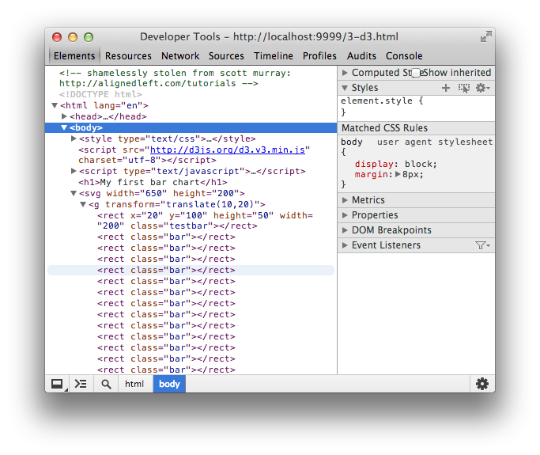
Why do we see it in the Inspector but nothing renders on the page?

</li>

<li>
  Let's give bars some attributes, like heights, widths, X and Y positions. To do that, though, we'll need ways to translate our data values into pixels based on our SVG element. We do that with <code>d3.scale</code> (a very good helper is, again, <a href="http://alignedleft.com/tutorials/d3/scales">on Scott Murray's site</a> for further reading).

  <pre>
    <code class="language-javascript">var y = d3.scale.linear()
.domain([0,6])
.range([0,height]);

var x = d3.scale.linear()
.domain([0,prices.length])
.range([0,width]);
    </code>
  </pre>

  Let's make sure we know what this code does before moving on.

</li>

<li>

  Let's modify the code to give height and x positions based on our data. Only two lines of this are new.

  <pre>
    <code class="language-javascript">var bar = d3.selectAll(".bar")
      .data(prices)
    .enter().append("rect")
      .attr("height", function(d) { return y(d.X2013); })
      .attr("width", 2)
      .attr("x", function(d, i) { return 3 * i})
      .attr("class", "bar");
</code>
  </pre>

Add some css so the bars are grey, too.

    <pre>
      <code class="language-html">.bar {
fill: #ddd;
}</code>
    </pre>

If your chart looks like this, you're in good shape.

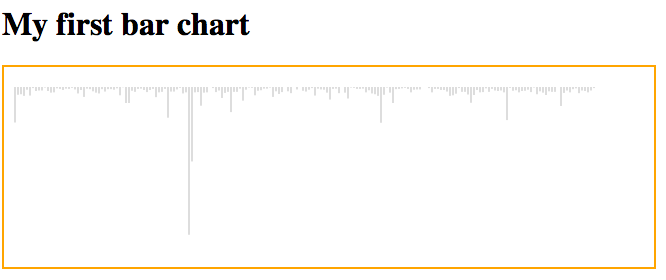

If you want to see this file, you can check it out <a href="3-d3.html">here</a>. What's still wrong with this plot? What needs adjusting?

    </li>

<li>
  
Let's modify the <code>y</code> attribute to get them all on the same baseline.

<pre><code class="language-javascript">var bar = svg.selectAll(".bar")
.data(prices)
.enter().append("rect")
.attr("width", 2)
.attr("height", function(d) { return y(d.X2013)} )
.attr("y", function(d) { return height - y(d.X2013)  })
.attr("x", function(d, i) { return 3 * i})
.attr("class", "bar");</code></pre>

It should look sort of like this:

  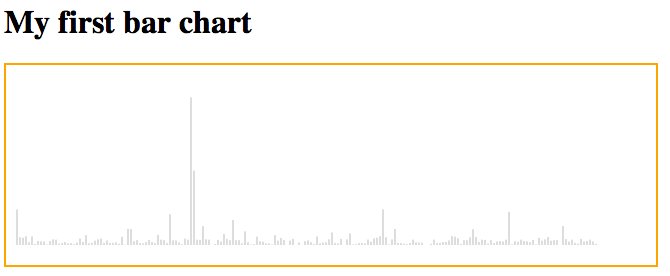
</li>

<li>We're getting closer, but we still should have our data sorted. Under the block where we cast <code>X2013</code> as a number, add this code. (Sorting in JS has never been fun, and even after 5 years this syntax is weird to Kevin.)

     <pre><code class="language-javascript">prices.sort(function(a,b) {
return a.X2013 - b.X2013;
});
</code></pre>
  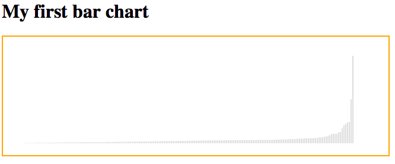

</li>

<li>
  
As a last step, we'll add a class that highlights ESPN. This says, "If the network is ESPN, class it g-ESPN. Otherwise do nothing."

<pre><code class="language-javascript">var bar = svg.selectAll(".bar")
.data(prices)
.enter().append("rect")
.attr("width", 2)
.attr("height", function(d) { return y(d.X2013)} )
.attr("y", function(d) { return height - y(d.X2013)  })
.attr("x", function(d, i) { return 3 * i})
.attr("class", "bar");
.classed("g-ESPN", function(d) { return d.Network == "ESPN"})</code></pre>

With corresponding CSS

<pre>
<code class="language-html">.g-ESPN {
  fill: red;
}</code>
</pre>

</li>

<li>Finally, let's lose the orange background and add a label for ESPN.

<pre><code class="language-javascript">svg.append("text")
.attr("class", "g-label")
.attr("x", 530)
.attr("y", 30)
.text("ESPN")
</code></pre>

With some styling and small tweaks of the height, you can make it look like this:

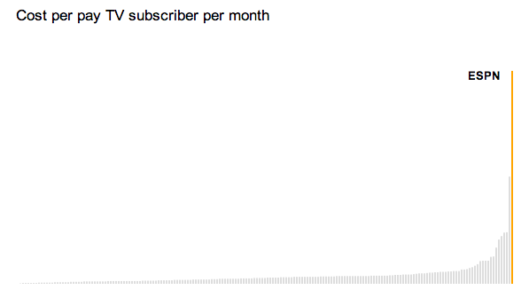

Try to get there on your own, and if you want to give up you can consult this <a href="4-d3.html">finished file</a>.

</ol>

##Homework

For your homework, you should make this bar chart as much like <a href="http://www.nytimes.com/2013/08/27/sports/ncaafootball/to-defend-its-empire-espn-stays-on-offensive.html#g-histogram">the one the NYT eventually published</a> as you can. You'll need to learn some new things to do it, but your professors and the internet can help you. This should be checked into git as its own repo.

Under this chart, write three other news-related questions or sentences you might have after viewing this chart that would be the basis for more reporting or requests for other data. For example, one of them might be, "Why do so many channels cost nothing?" or "How have these prices changed over time? It might be interesting to see whether ESPN's growth happened sharply or slowly" or "Even though they're not part of the standard cable package, how would a channel like HBO compare?

  This homework must be completed and checked in by <strong>Tuesday, September 17</strong> at noon. It should be linked to from your main index page.

##Useful links

An <a href="http://bl.ocks.org/mbostock/1166403">axis component</a> block.

Scott Murray's tutorial, already referenced a few times here, <a href="http://alignedleft.com/tutorials/d3/axes">covers axes and coloring</a> too.

