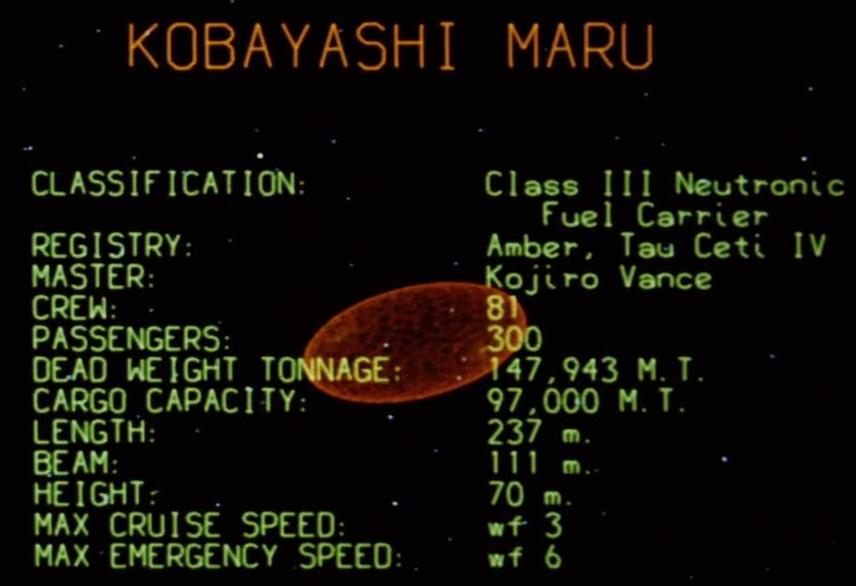

##Housekeeping

• About your pitches.

• Mapping homework showcase!

• Office hours this weekend at 4

• Free help on the [wiki](https://github.com/shancarter/ucb-dataviz-fall-2013/wiki/Things-We-Don't-Get)

##Critique
Angela and Pearly will be discussing [tXXXXX](http://www.google.com).

##News exercise

We've done a few do-as-we-do exercises; today we'll break into groups and let you come up with your own visualizations.

**Here's the scenario:** You're an intern at the data desk of the Los Angeles Times. You've you've noticed that every month when unemployment numbers come out, they only publish the top-level rates, with no other details. You're hoping to make an impact as an intern so you can get hired (obviously!), but you're also interested in helping readers understand unemployment rates in the state in a more nuanced way.

The Bureau of Labor Statistics has loads of data about employment, but the one you're planning on using is Smoothed Seasonally Adjusted Metropolitan Area Estimates for Calfornia. Today in class, you'll explore this data, ask and answer questions, make a visualization and publish it to the internet.

We'll break into 5 groups for this.

**Group 1:** Erik Reyna, Chelsi Moy, Stephen Fisher

**Group 2:** Diego Barido, Aaron Mendelson, Samantha Masunaga

**Group 3:** Mihir Zaveri, Julie Brown, Angela Lyn Hart

**Group 4:** Jessica Hamel, Sean Greene, Tawanda Kanhema

**Group 5:** Pearly Tan, Sam Rolens, Nausheen Husain

**Here's your rough schedule**

###4:30pm###
- Download and format the [data](http://www.bls.gov/lau/metrossa.htm). Load it into Excel, R or D3.

- Download and format the [data](http://www.bls.gov/lau/metrossa.htm). Load it into Excel, R or D3.

- As a group, come up with 6 questions that you want to answer

###4:45pm###
- Call Shavin over to approve your questions. Don’t continue without approval.

###5pm###
- Answer your questions.

- Sketch **on paper** what you want to build with your new knowledge.

###5:30pm###
- Get Shavin approval of your sketch before you continue.

- Decide who's doing what. Here’s one idea for roles but feel free to do whatever you want:
    1. Research and write the text
    2. R sketching and answering data questions
    3. Web development of the whole project

###6:30pm###
- Publish a URL to a github repo.
- **6:30pm** and publish a URL to a github repo.

- **6:45pm** We’re all going to share our projects.

###6:45pm###
- Show and tell.
