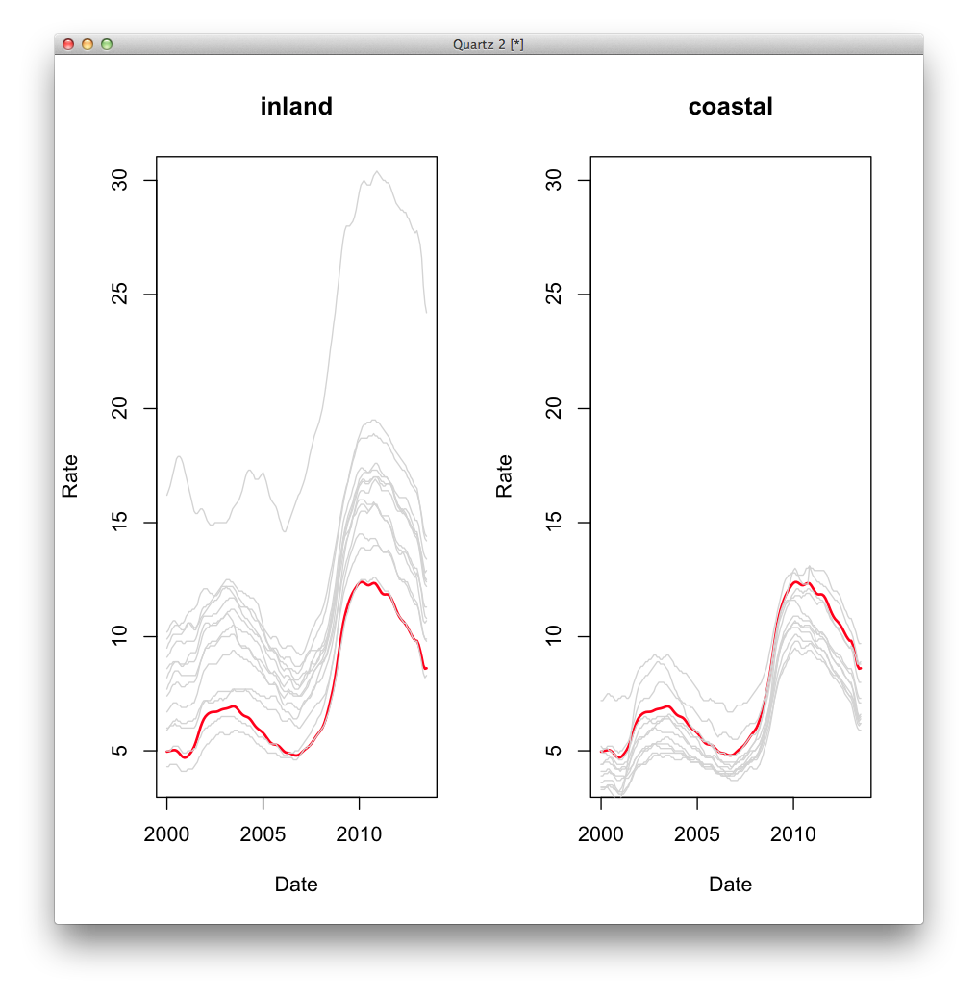

##Housekeeping

• About your pitches.

• Mapping homework showcase! A handful of notable different approaches by [Erik](http://erikreyna.github.io/maps-intro/interactive-map.html), [Jess](http://jessihamel.github.io/maps-intro/) and [Sam](http://scrolens.github.io/map-intro/), to name a few.

• Office hours this weekend at 4

• Free help on the [wiki](https://github.com/shancarter/ucb-dataviz-fall-2013/wiki/Things-We-Don't-Get)

##Critique
Angela and Pearly will be discussing this [Painkiller prescriptions map](http://va-opiates.apps.cironline.org).


##News exercise

We've done a few do-as-we-do exercises; today we'll break into groups and let you come up with your own visualizations.


###Here’s the scenario
You're an intern at the data desk of the Los Angeles Times. You've you've noticed that every month when unemployment numbers come out, they only publish the top-level rates, with no other details. You're hoping to make an impact as an intern so you can get hired (obviously!), but you're also interested in helping readers understand unemployment rates in the state in a more nuanced way.

The Bureau of Labor Statistics has loads of data about employment, but the one you're planning on using is Smoothed Seasonally Adjusted Metropolitan Area Estimates for Calfornia. Today in class, you'll explore this data, ask and answer questions, make a visualization and publish it to the internet.

We'll break into 5 groups for this.

**Group 1:** Erik Reyna, Chelsi Moy, Stephen Fisher

**Group 2:** Diego Barido, Aaron Mendelson, Samantha Masunaga

**Group 3:** Mihir Zaveri, Julie Brown, Angela Lyn Hart

**Group 4:** Jessica Hamel, Sean Greene, Tawanda Kanhema

**Group 5:** Pearly Tan, Sam Rolens, Nausheen Husain


####Here’s your rough schedule###

###Starting at 4:45pm###
- Download and format the [data](http://www.bls.gov/lau/metrossa.htm). Load it into Excel, R or D3.

- As a group, come up with at least 6 questions that you want to answer using a Google doc or raw text file

###Starting at 5:00pm###
- Call Shavin over to approve your questions. Don’t continue without approval.

###Starting at 5:15pm###
- Start answering your questions in text form.

- Sketch **on paper** what you want to build with your new knowledge.

###Starting at 5:45pm###
- Get Shavin approval of your sketch before you continue.

- Decide who's doing what. Here’s one idea for roles, but feel free to do whatever you want:
    1. Research and write the text.
    2. R sketching and answering data questions.
    3. Web development of the whole project. (You don't need to make your chart in D3. Images are fine, but they do need to be published to the internet on a valid HTML page. )

###Starting at 6:45pm###
- Publish a URL to a github repo.

- **6:30pm** and publish a URL to a github repo.

- **6:45pm** We’re all going to share our projects.

###Starting at 7:00 (to 7:15?)pm###
- Show and tell.

<a href="#update" id="update">
###Update
</a>

For those of you who saw what we did with this data for [a quick daily](http://www.nytimes.com/interactive/2012/11/27/us/recovering-but-at-different-paces.html?ref=us), the R code used to make this is included below.

```r
setwd("~/your-working-directory")

library(gdata)

#I did loose formatting on this – deleted empty rows
data <- read.xls("ssamatab1-f.xls", stringsAsFactors=F)

# rename the fields, makes for easier typing and fewer mistakes.
names(data) <- c("code", "stfips", "areafips", "area", "year", "month", "labor_force", "employment", "unemployment", "rate" )

# get rid of the commas in the employment numbers fields
# also, turn it from a string to a number so we can do math on it.
data$labor_force <-   as.numeric(gsub(",", "", data$labor_force ))
data$employment <-    as.numeric(gsub(",", "", data$employment ))
data$unemployment <-  as.numeric(gsub(",", "", data$unemployment ))

#a true date field, assigning the value arbitrarily to the first of the month.
data$date <- paste(data$year, data$month, "1", sep="-")
data$date2 <- as.Date(data$date, format="%Y-%m-%d")

# just the city name, for labeling nicer. optional.
# this code says, split up each value in the vector into chunks where you see a comma,
# then give me the first chunk back.
data$city <- sapply(strsplit(data$area, split=","), function(x) { x[1] })

#just california
ca_cities <- subset(data, stfips == 6)

#this is a manual job.
coastal <- c("Salinas", "Vallejo-Fairfield", "Los Angeles-Long Beach-Santa Ana", "Oxnard-Thousand Oaks-Ventura", "San Diego-Carlsbad-San Marcos", "Santa Rosa-Petaluma", "San Francisco-Oakland-Fremont", "San Luis Obispo-Paso Robles", "Santa Barbara-Santa Maria-Goleta", "Napa", "San Jose-Sunnyvale-Santa Clara", "Santa Cruz-Watsonville")
inland <- c("Bakersfield-Delano", "Chico", "El Centro", "Fresno", "Hanford-Corcoran", "Madera-Chowchilla", "Merced", "Modesto", "Redding", "Riverside-San Bernardino-Ontario", "Sacramento--Arden-Arcade--Roseville", "Stockton", "Visalia-Porterville", "Yuba City")

# make a new vector called setting. then set it depending on whether it's coastal or inland.
ca_cities$setting <- NA
ca_cities$setting[ca_cities$city%in%coastal] <- "coastal"
ca_cities$setting[ca_cities$city%in%inland] <- "inland"

# average for california - two lines gets us what we need!
ca_avg <- aggregate(ca_cities[,c("unemployment", "labor_force", "employment")], list(date2=ca_cities$date2), sum)
ca_avg$rate <- 100 * ca_avg$unemployment / ca_avg$labor_force

#sort it just to make sure
ca_avg <- ca_avg[order(ca_avg$date),]

# make a function -- dont have to but it's cleaner to read.

plot_regional_rates <- function(region) {

  #just records from this setting (inland/coastal)
  this_region <- subset(ca_cities, setting == region)

  #plot the ca average
  plot(ca_avg$date, ca_avg$rate, type = "l", ylim = c(4, 30), col="red", lwd = 2, xlab="Date", ylab="Rate", main = region )

  #add lines for cities in this group
  for (i in unique(this_region$city)) {
    this_city <- subset(this_region, city == i )
    lines(this_city$date2, this_city$rate, col="lightgrey")
  }
}

#plot in a 2x1 grid
par(mfrow=c(1,2))
plot_regional_rates("inland")
plot_regional_rates("coastal")


```




