##Housekeeping

• Are you a member of the [class Google Group](https://groups.google.com/forum/#!forum/ucb-datavis-2013)? Are you sure? **Are you really sure?**

• Are you on our github [class roster](https://github.com/shancarter/ucb-dataviz-fall-2013/wiki/Roster) page?

• You should all have gotten feedback on both assignments by now.

• Common mistakes/helpful tips (we emailed these too):

  - Dynamically calculating averages (or establishing any hierarchy in a data set) in Javascript can be much easier with D3.nest(). There are some examples of this [here](http://bl.ocks.org/phoebebright/raw/3176159/), but you should check out Shan's wonderful [Mister Nester](bl.ocks.org/shancarter/raw/4748131) as a guide.

  - Color should be used primarily for communicating information. When you use color for anything other than encoding data or as a category label, its use gets confusing. If you use Purple text in the headline just as decoration, then when you use color to indicate something meaningful in another part of your graphic people will be confused. They will have to stop and think "is this decorative or does this color mean something". Basically, it should always mean something.

  - Choose any font you want, as long as it's not Times New Roman. It just screams out that you didn't take the time to style your page (because you probably didn't). In general, Arial, Georgia and Verdana are very popular. For now, the rule should be, "Don't make anything that you've never seen on another web site before." That means no hot-pink comic sans, etc etc. Text should be black, background colors should be white. If you want to peruse the day's graphics that went into the NYT in print (so you can see their design decisions), check out [this site](https://www.nytsyn.com/images/graphics/)

  - Always label your axis. Rarely can you get away with having numbers on a chart without any units (the difference between "9" and "9 strikeouts" or "9 strikeouts per game"). Tell people what your numbers represent. Sometimes you can get away with it if it's super clear from your headline, but mostly it's a good habit to get into.

• Office hours this weekend at 4

• Two new wikis: first, a [wiki](https://github.com/shancarter/ucb-dataviz-fall-2013/wiki/Things-We-Don't-Get) where you can ask any questions you might have about D3, data, or anything. (Like "what is a data join" or "how do I make a table in D3" or "can I subset by multiple values in R?"). And another one for the [schedule for critiques](https://github.com/shancarter/ucb-dataviz-fall-2013/wiki/Class-presentation-schedule).

##Critique
Julie and Jess will be discussing [these charts of unisex names](http://flowingdata.com/2013/09/25/the-most-unisex-names-in-us-history/). For fun, let's also discuss [a similar set of charts](http://www.nytimes.com/imagepages/2009/05/17/weekinreview/20090517_NAME_GRFK.html) from the NYT.

##Lecture
We'll be [looking at a variety of maps](maps-lecture-2013.pdf) originally compiled by Amanda Cox.

##Lab Part 1

Say you're a reporter at [California Watch](http://californiawatch.org/) and the California Department of Finance releases [a new report](http://www.dof.ca.gov/research/demographic/reports/projections/) estimating demographic levels by county through 2060. They do have a press release, but it really only says that Hispanics will be the majority in California by 2060, but you want to dig deeper. You add in some historical Census data and get [this txt file](merged-multirace.txt).

What questions might you want to ask this data?

1. As we've done before, we'll start by making make a local repo with an empty index.html file and an R file. Call your repo "maps-intro" and your R file `California.R`. Save the data above, `merged-multirace.txt` to this folder.

2. Set your working directory like we've done in previous classes and load the data.

  ```r
  data <- read.delim("merged-multirace.txt")
  ```

  What basic information do we always find out about a dataset when we load it?

3. Find out which counties have the highest and lowest proportions of each race in 2020. (There are many ways to do this – either sort or filter.)

4. Make a chart that shows the percentage of Asains in San Francisco county from 1980 to 2020. First, get a data frame for just San Francisco county.

  ```r
  sf <- subset(data, county == "San Francisco")
  ```

  Take a look af `sf`. What fields do we want to plot?

5. Now make your plot.

  ```r
  plot(sf$year, sf$pcthispanic, type="l", ylim=c(0,max(data$pcthispanic)), main="Hispanics in San Francisco County")
  ```

  What's wrong with our chart, and why?

  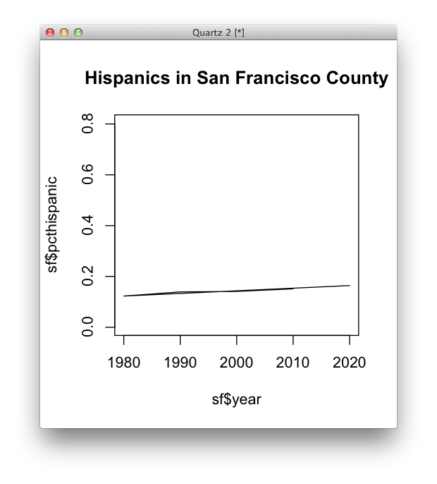

6. Sort your data and replot.

  ```r
  sf <- sf[order(sf$year), ]
  plot(sf$year, sf$pcthispanic, type="l", ylim=c(0,max(data$pcthispanic)), main="Hispanics in San Francisco County")
  ```
  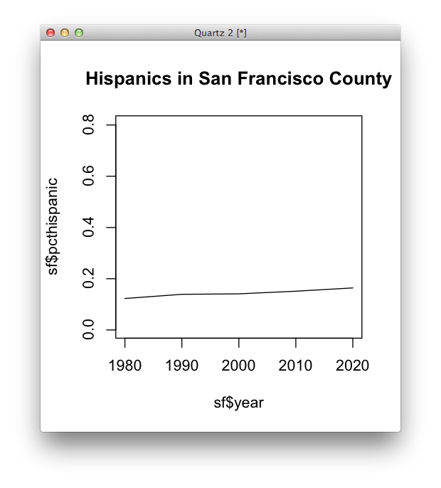

7. That's good, but what doesn't it tell us about the actual number of Asian people living in San Francisco county over time? Make a new field in your data called ```hispanic_pop```

  ```r
  data$hispanic_pop <- data$totalpop * data$pcthispanic
  ```

  Which county had the most and fewest Hispanics living in it in 2010?

8. Make similiar fields in your data for percent Asian, white and black. When you're done, `names(data)` shoud look something like this:

  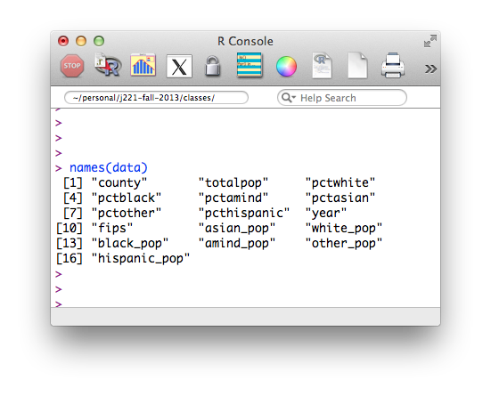

9. In the past, we've said you need to be able to do only 4 things to be dangerous: filter, sort, aggregate and merge. We've done two of the four in the last two classes. Today we'll do the last two. First, let's get a data frame for the total percent of hispanics for the whole state.

  ```r
  ca_hispanic_pop <- aggregate(data$hispanic_pop, list(data$year), sum)
  names(ca_hispanic_pop)
  names(ca_hispanic_pop) <- c("year", "tot_hisp_pop")
  ```

  What does this data frame represent? Is it normalized? What would we need to normalize it?

10. Make a similar data frame with overall popstate totals for every year.

  ```r
  total_ca_pop <- aggregate(data$totalpop, list(data$year), sum)
  names(total_ca_pop)
  names(total_ca_pop) <- c("year", "tot_ca_pop")
  ```


9. Let's take a look at the code we did to make this chart:

  ```r
  sf <- subset(data, county == "San Francisco")
  sf <- sf[order(sf$year),]

  plot(sf$pcthispanic, type="l", ylim=c(0,max(data$pcthispanic)) )
  ```

10. Now let's merge these two data frames. What field do they have in common?

  ```r
  state_totals <- merge(total_ca_pop, ca_hispanic_pop, by="year")
  head(state_totals)
  ```

  Now normalie and plot the percent of all hispanics in California.

  ```r
  state_totals$pcthispanic <- state_totals$tot_hisp_pop/state_totals$tot_ca_pop
  ```

  It might look like this:
  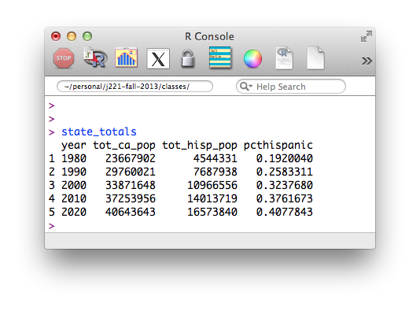

11. Now plot it:

  ```r
  plot(state_totals$year, state_totals$pcthispanic, main="Calif. pct Hispanic", ylim=c(0,max(data$pcthispanic)), type="l", col="red", lwd=2)
  ```

  

12. Add our previous SF data to this:

  ```r
  plot(state_totals$year, state_totals$pcthispanic, main="Calif. pct Hispanic", ylim=c(0,max(data$pcthispanic)), type="l", col="red", lwd=2)
  lines(sf$year, sf$pcthispanic)
  ```

  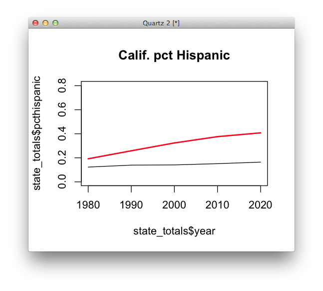


13. A few slight changes to our code. Recognize the difference?

  ```r
  #selected county
  county_name <- "San Francisco"

  #filter
  this_county <- subset(data, county == county_name)

  #sort
  this_county <- this_county[order(this_county$year),]

  #initial plot command, with state totals in red
  plot(state_totals$year, state_totals$pcthispanic, main="Calif. pct Hispanic", ylim=c(0,max(data$pcthispanic)), type="l", col="red", lwd=2)

  #this county.
  lines(this_county$year, this_county$pcthispanic)

  ```

14. Let's generalize most of that into a function.

  ```r
  plot_lines_for_county <- function(county) {
      county_name <- county
      this_county <- subset(data, county == county_name)
      this_county <- this_county[order(this_county$year),]
      lines(this_county$year, this_county$pcthispanic)
  }
  ```

15. This seems like a lot of work, but it lets us now add lines to any plot.

  ```r
  plot(state_totals$year, state_totals$pcthispanic, main="Calif. pct Hispanic", ylim=c(0,max(data$pcthispanic)), type="l", col="red", lwd=2)
  plot_lines_for_county("Los Angeles")
  ```

  

16. The point of all this is flexibility. Now we can plot all the lines, whether there are 50 or 50,000.

  ```r
  plot(state_totals$year, state_totals$pcthispanic, main="Calif. pct Hispanic", ylim=c(0,max(data$pcthispanic)), type="l", col="red", lwd=2)

  #all the counties
  for (i in unique(data$county)) {
    plot_lines_for_county(i)
  }
  ```
  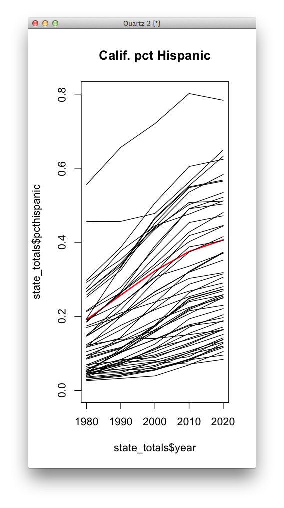

17. Let's make a new function that factors in the total population of these lines rather than just percentages.

  ```r
  plot_weighted_lines_for_county <- function(county) {
      county_name <- county
      this_county <- subset(data, county == county_name)
      this_county <- this_county[order(this_county$year),]
      lines(this_county$year, this_county$pcthispanic, lwd= this_county$hispanic_pop/100000 )

      y2020 <- subset(this_county, year == 2020)
      text(y2020$year, y2020$pcthispanic, labels=y2020$county, adj=0, cex=.5)
  }
  ```

  Now do the same code as before but with the new function:

  ```r
  plot(state_totals$year, state_totals$pcthispanic, main="Calif. pct Hispanic with population sizing", ylim=c(0,max(data$pcthispanic)), type="l", col="red", lwd=2, xlim=c(1980, 2030))

  #all the counties
  for (i in unique(data$county)) {
    plot_weighted_lines_for_county(i)
  }
  ```

  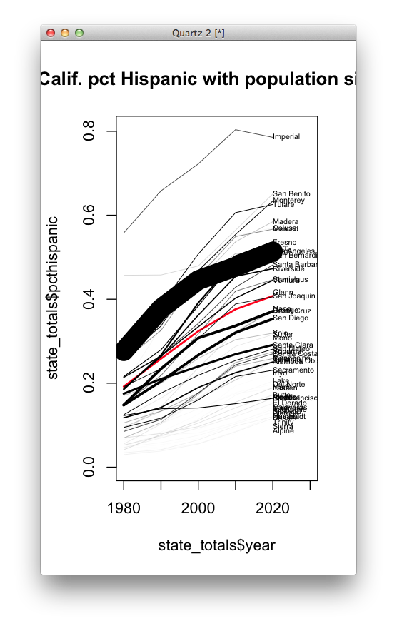

  Is this a perfect sketch? No, it is not. But it communicates information about which counties have the most people living in them. Which chart you would choose simply depends on your audience. The Times published this one:

  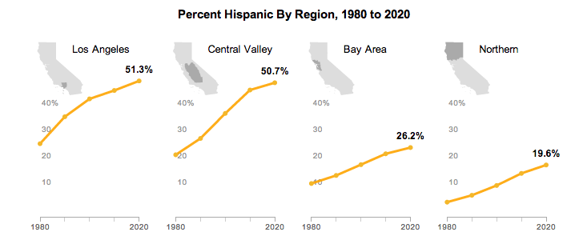

##Lab Part 2

1. The lines help us find out which counties have which trends, but we don't have a very good idea of which counties are where. To visualize the spatial relationship, a map might be a good idea. (Even if we'll just throw it out later, it's usually good to at least check what the map looks like if we can.)

2. Install the R package "maptools" in your R console.

  ```r
  install.packages("maptools")
  library(maptools)
  ```

3. Download [this zip file](http://shancarter.github.io/ucb-dataviz-fall-2013/classes/maps-intro/shapes/ca.zip) to your local repo. Save it to a folder called `shapes`. It's actually 5 files (if you look at it from a Mac).

  Now load the shapefile using `readShapePoly`

  ```
  shapes <- readShapePoly("shapes/ca/counties.shp")
  ```

  Do the things we always do with data we load: find its class, field names, etc. It's a little trickier for these kinds of objects. Also try ```data.frame(shapes)``` and check out the data.

4. Make a map!

  ```r
  plot(shapes)
  ```
  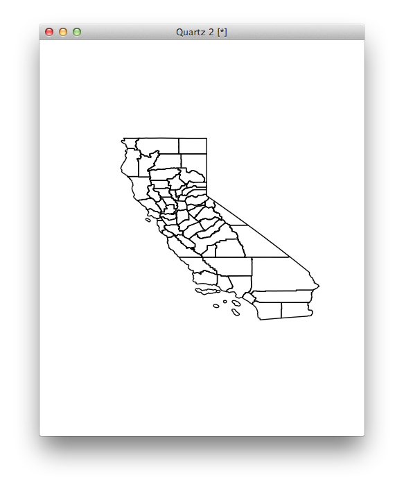

5. Like any plot, this takes the same arguments (mostly).

  ```r
  plot(shapes, col=rainbow(100))
  axis(1)
  ```

  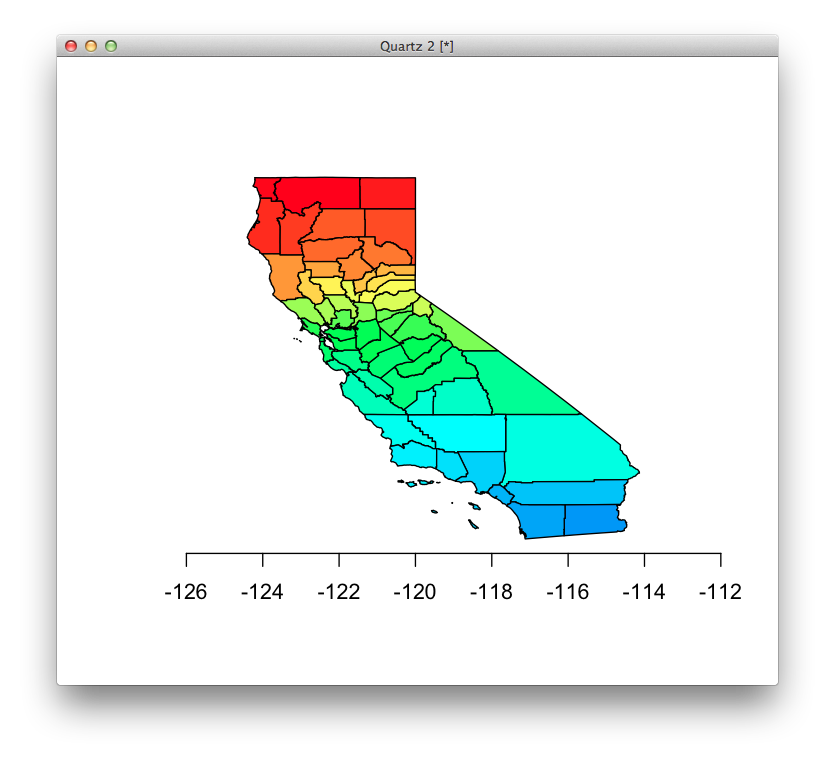

5. Super awesome, but not very meaningful. Take a look at the data behind the map again with `data.frame(shapes)`. What do the field names represent? Do we have anything in our data frame that might work as a match? (Hint, take a look at the `FIPS` field in `data.frame(shapes)`. What's the difference between that field and our `fips` field?

6. Let's store the shapefile attribute table as a variable just to save some typing:

  ```r
  map_data <- data.frame(shapes)
  ```

6. Let's make a `FIPS` field in `data`. This is a formatting trick in R to get leading zeros, which we need if the fields are going to match.

  ```r
  data$FIPS <- sprintf("%05d",data$fips)
  ```

7. Let's reduce `data` to just the year 2010 for our map...

  ```r
  y2010 <- subset(data, year == 2010)
  ```

  and let's see if our `FIPS` fields matched up ok with the `map_data` notation.

  ```r
  y2010$FIPS%in%map_data$FIPS
  ```

  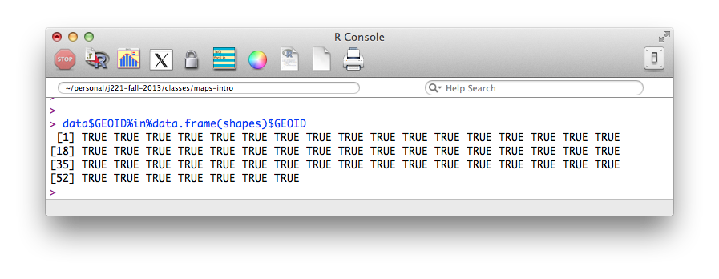

  What does this mean?

7. Let's join them. There are many ways to do this, but one of the safest ones is with ```match```. Let's take a look in pieces. This looks odd, but it's the answer to the question, "What row number in map_data$FIPS will I find the same value in `data$FIPS`?


  ```r
      match(map_data$FIPS,y2010$FIPS)
  ```

  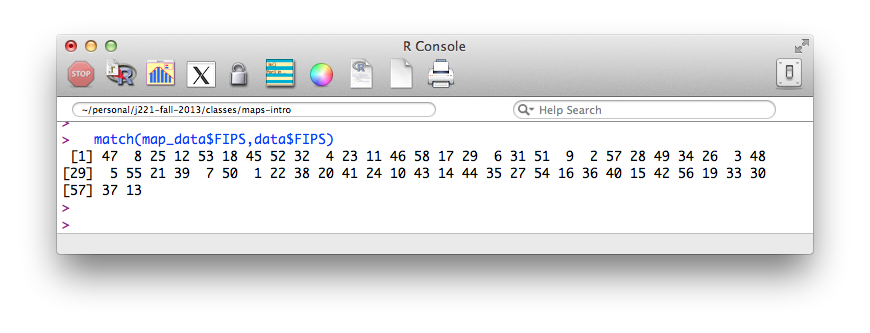
  What do the numbers you get back represent?

8. Let's call that vector something and store it.

  ```r
     match_order <- match(map_data$FIPS,y2010$FIPS)
  ```

9. Let's compare these two vectors of numbers and see if we understand the difference.

  ```r
  y2010$pcthispanic
  y2010$pcthispanic[match_order]
  ```
  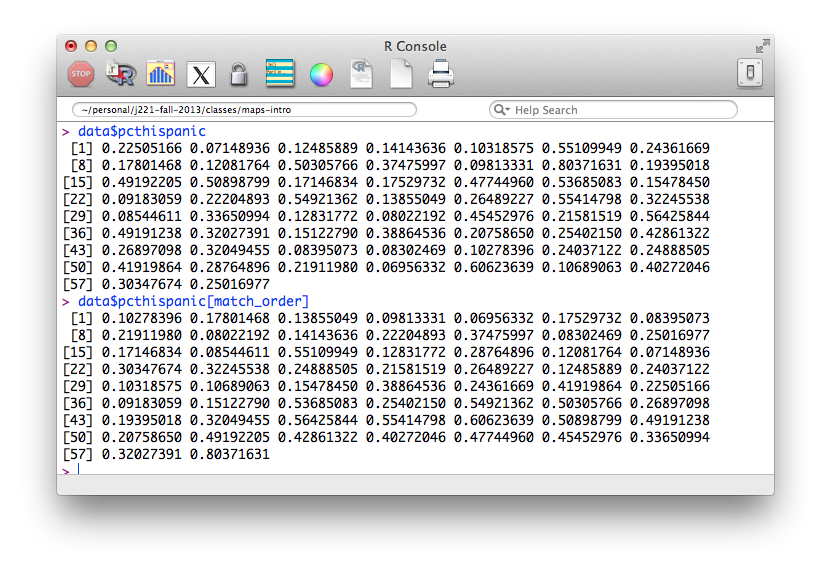

10. Let's add this field to our `map_data`.

  ```r
  map_data$pctHispanic2010 <- y2010$pcthispanic[match_order]
  ```

11. All this work is so we can associate a county on our map with a value in our data – and now we've done it. But to make a choropleth map, we still need to associate it with colors. So we need to create a vector of colors that corresponds to the values in our `map_data$pctHispanic2010`.

11. Say we want to make a color palette from yellow to red. First, we need to decide what thresholds would be meaningful to color our shapes. Let's look at the distribution of our data by making a histogram of `map_data$pctHispanic2010`.

  ```r
  hist(map_data$pctHispanic2010)
  ```
  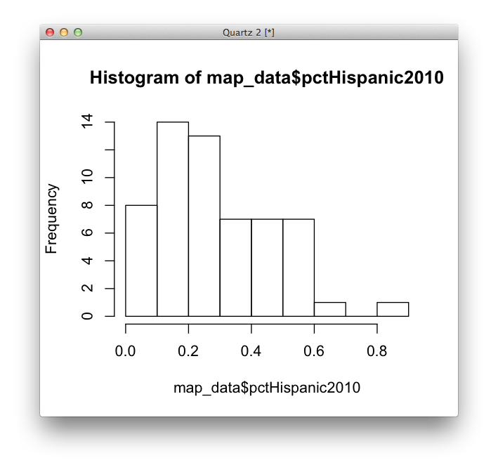

  If we wanted to break this up into 5 buckets, where might we divide them?

12. We'll try breaks every .1 and put everything over .4 into the largest bucket.

  ```r
  map_breaks <- c(0, .1, .2, .3, .4, 1)
  ```


13. To find out which "bucket" each value goes in, we can use an R method called `cut`. Try both of these:

  ```r
  buckets <- cut(map_data$pctHispanic2010,breaks=map_breaks)
  numeric_buckets <- as.numeric(buckets)
  ```

  We'll use `numeric_buckets` for sanity, but as far as R is concerned, they are equivalent.

14. Now we have a bucket for our values that can correspond easily to discrete colors. All we need is the colors! Install the wonderfull R [color brewer](http://colorbrewer2.org/) R package.

  ```r
  install.packages("RColorBrewer")
  library(RColorBrewer)

  display.brewer.all()
  ```

  Let's take a look.

  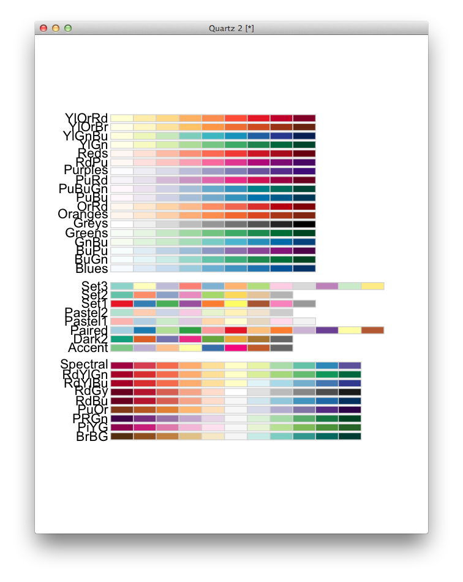

15. Let's get a vector of 5 colors on the yellow-orange-red scale ("YlOrRd").

    ```r
    colors <- brewer.pal(5,"YlOrRd")

    # returns [1] "#FFFFB2" "#FECC5C" "#FD8D3C" "#F03B20" "#BD0026"
    ```

    These five colors will correspond to our 5 numeric buckets. Here's a way to help visualize how this works. `map_breaks` has six elements, but we will use it to assign one of five color values for each `pctHispanic2010` valuein our data.

    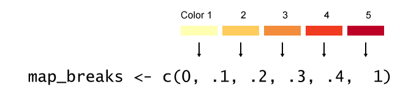


14. This should return a vector of colors that corresponds to our data values:

  ```r
   colors[numeric_buckets]
  ```

  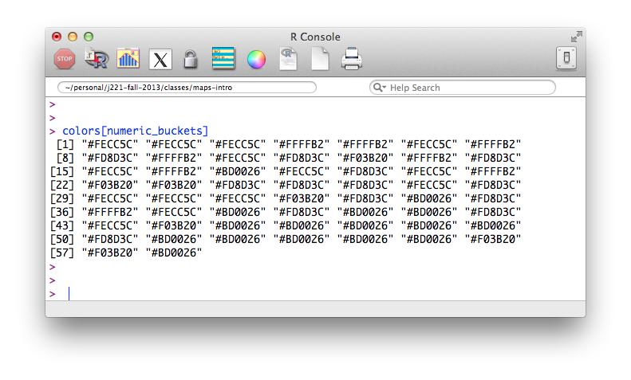

15. Now let's put this together and plot our map:

  ```r
  plot(shapes, col=colors[numeric_buckets])
  title("Pct Hispanic by County, 2010")
  ```

  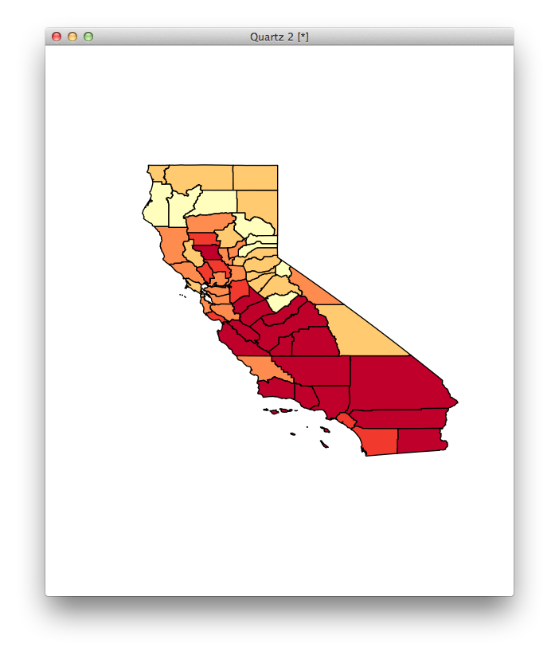

  Sweet!

16. What's the good part about all this code? For one, we could customize it to any choropleth map, or we could use functions to map other races in without any extra code. Or we can tinker with the colors and buckets easily without doing much work. Basically, now that we have the code, making 100 maps takes the same amount of time as making one. Or, if we had national data and a national map, the same amount of code would work.

17. Here's all the code that does our mapping in one place:

  ```r
  setwd("~/YOUR-WORKING-DIRECTORY")

  # we'll need these packages
  library(maptools)
  library(RColorBrewer)

  # load our data
  data <- read.delim("merged-multirace.txt")

  # load the shape file
  shapes <- readShapePoly("shapes/ca/counties.shp")

  #a data frame of the map attribute data
  map_data <- data.frame(shapes)

  #string work to add a leading zero and make a new vector that matches map_data's fips code.
  data$FIPS <- sprintf("%05d",data$fips)

  #2010 only
  data <- subset(data, year == 2010)

  #match order of data and shapes fields
  match_order <- match(map_data$FIPS,data$FIPS)

  #add this field to map_data
  map_data$pctHispanic2010 <- data$pcthispanic[match_order]

  #these can be changed...picked manually depending on our distribution
  map_breaks <- c(0, .1, .2, .3, .4, 1)

  #assign the data to one of these buckets
  buckets <- cut(map_data$pctHispanic2010,breaks=map_breaks)
  numeric_buckets <- as.numeric(buckets)

  #a vector of 5 colors.
  colors <- brewer.pal(5,"YlOrRd")

  #plot
  plot(shapes, col=colors[numeric_buckets])
  ```

##Homework

UPDATE: Class ended up going a little bit long, so homework will be relatively simple.

**Required**

Post an image (screenshot, export, whatever) of a map of the percent of hispanics by county in 2010 to your maps-intro repo. You should link to this on your dataviz-home site just like you have done for the other assignments. You are free to choose a different color scale or make other styling decisions if you prefer.

**Gold stars**

Most of you should be able to do the homework without too much trouble just by working through the lab. But getting comfortable with the R console will be worth your time int he future, and it's an extremely powerful tool for mapping, so extra practice will help. So try to do what you can from these:

We didn't go over these in class, so they are not required, but in general every map should have these:

• A title (either in R or in HTML)

• A key or legend (either in R or in HTML/CSS)

Try to produce maps for more races and more years. You could always repeat the code by changing the field names and values to subset, but see if you can **generalize the code enough to make a function called `plot_map_for__decade_and_race.` The goal is to tell R a racial group and a year and it produces a map for you:

  ```r
  plot_map_for_decade_and_race <- function (decade, race) {
  #code goes here!
  }
  ```

You would use this function like this:

  ```r
  plot_map_for_decade_and_race(1990, "pcthispanic") #produces awesome map
  ```

Shan will be at office hours starting at 4 and I might even be there a little earlier.

Here is what the NYT [ended up with](http://www.nytimes.com/interactive/2013/02/20/us/hispanics-californias-next-majority.html). Look how much fun you get to have with maps once you are good at Javascript:

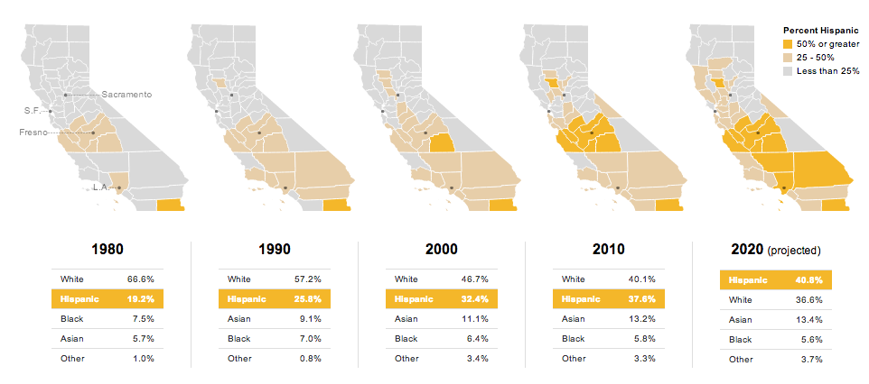
