<h1>Gallery of Your Bar Charts!!!</h1>

Here are screenshots of the charts you turned in for week 1. Check out your classmates' code on the <a href="https://github.com/shancarter/ucb-dataviz-fall-2013/wiki/Roster">class wiki</a>, which should point you to their github sites.

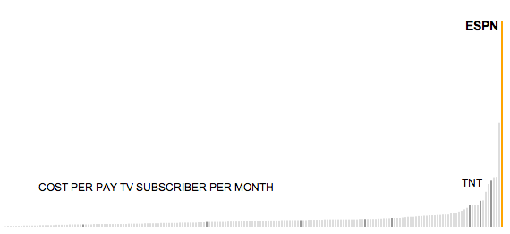
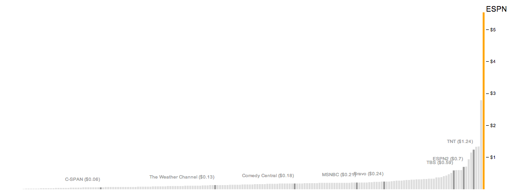
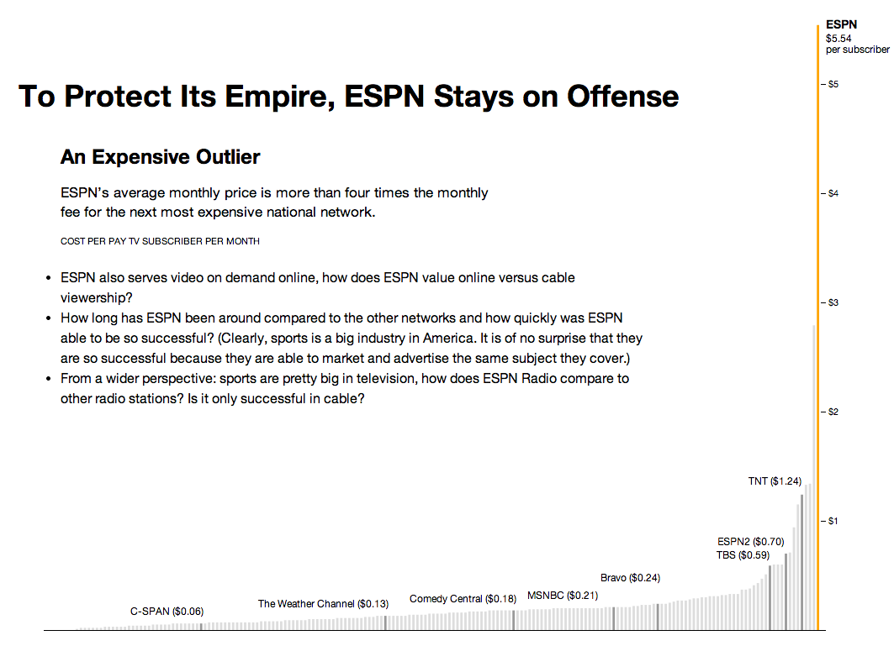
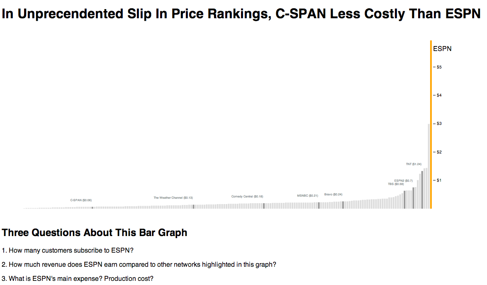
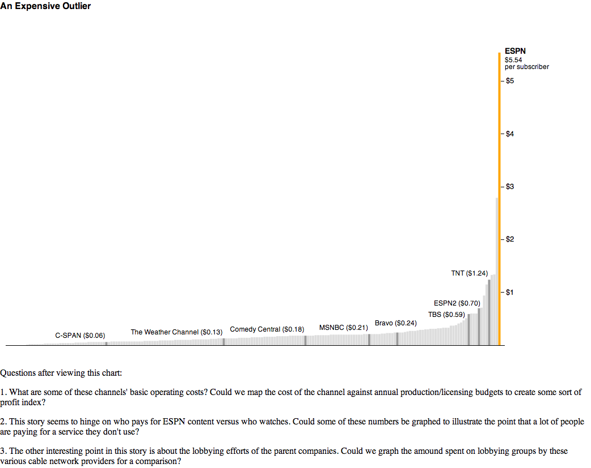
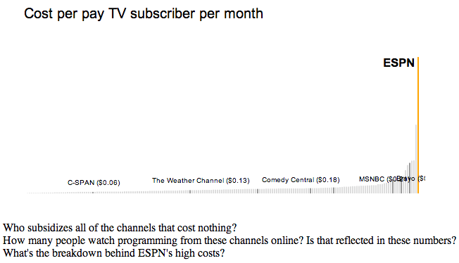
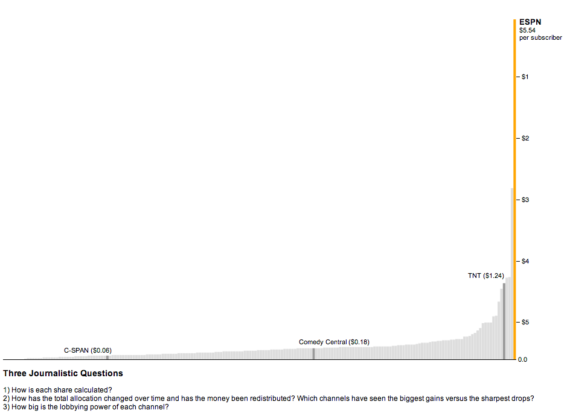
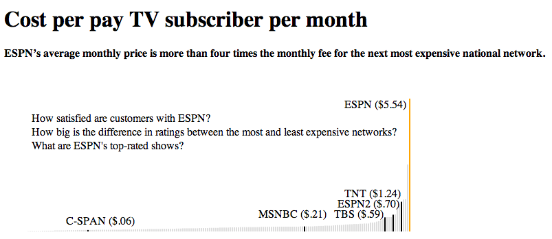
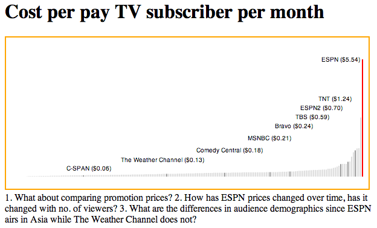
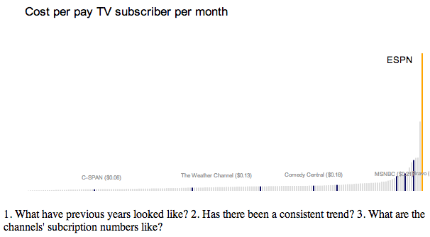
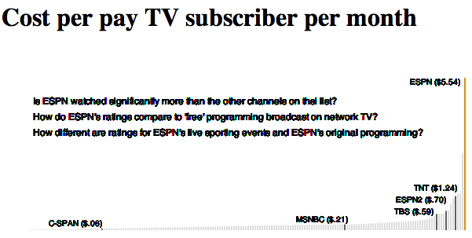
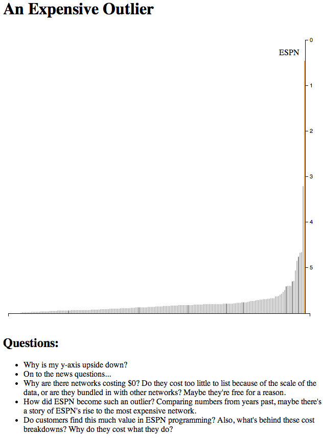
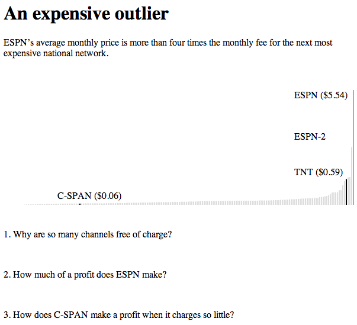
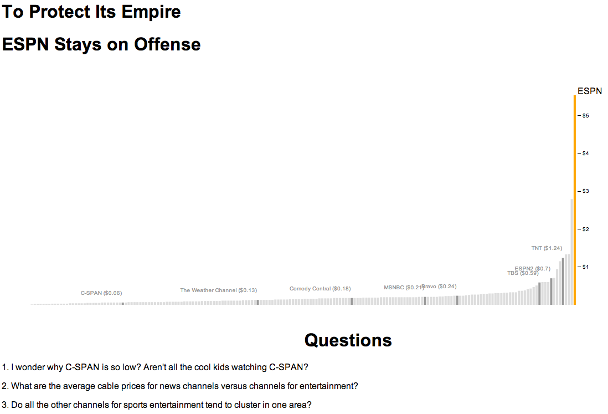
