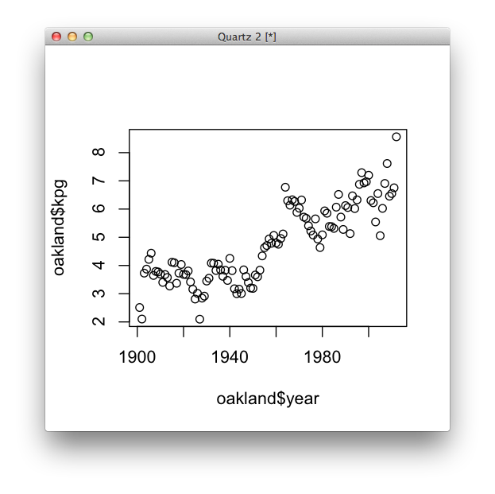
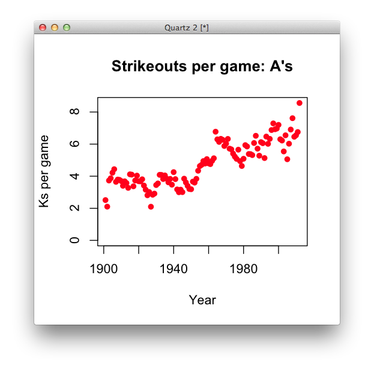
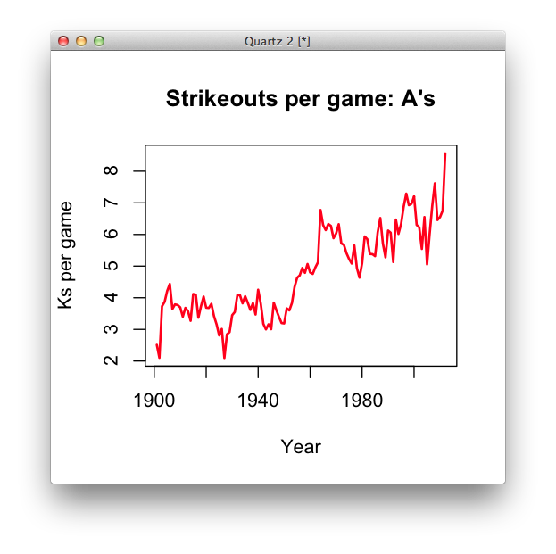
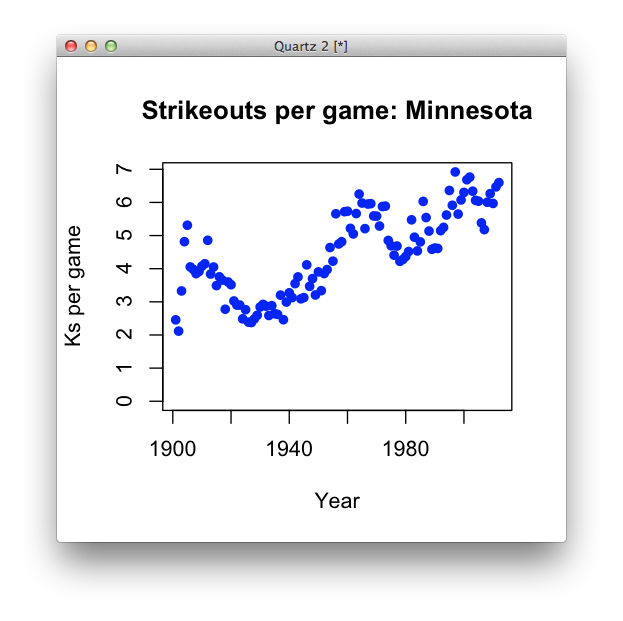
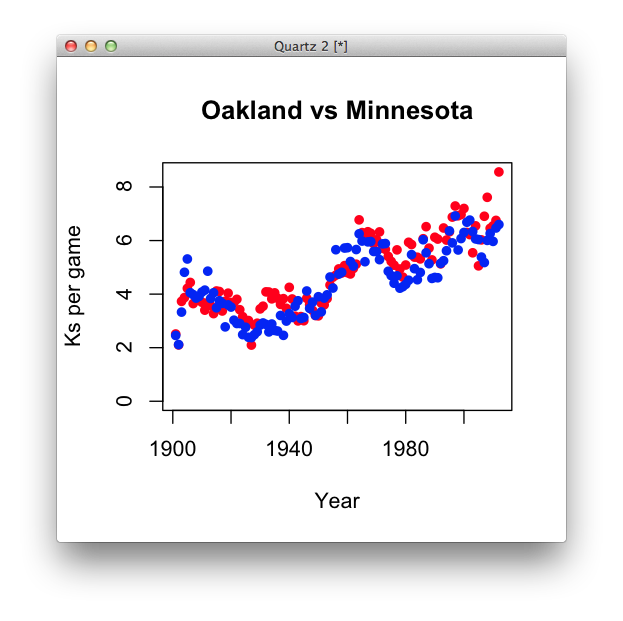
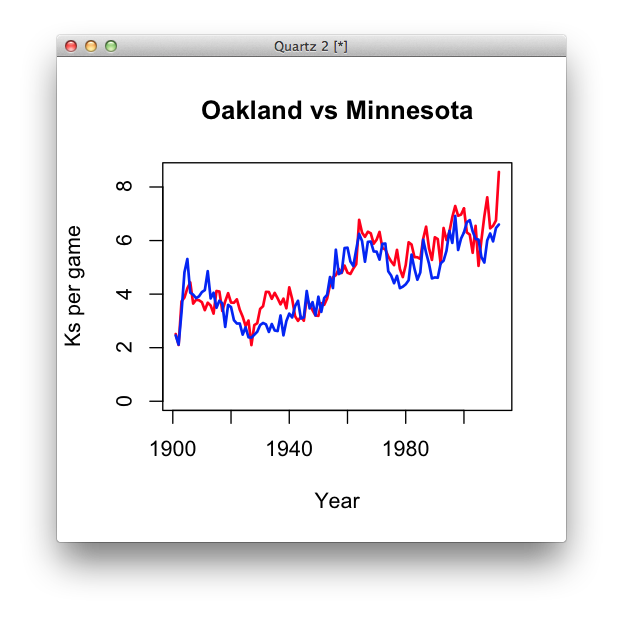
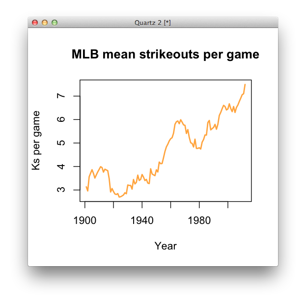
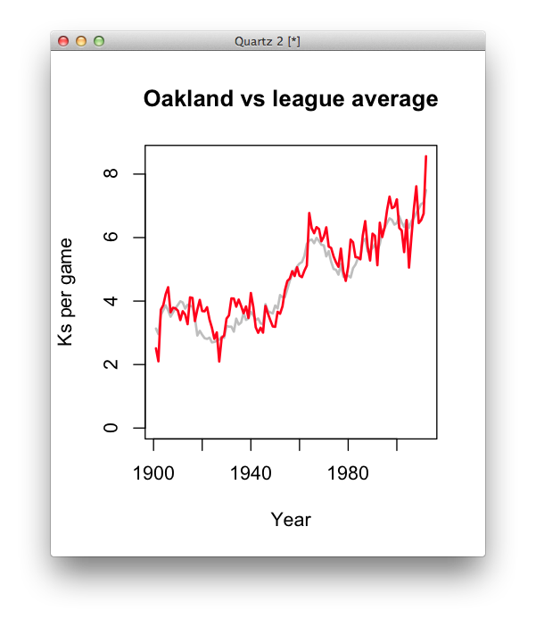

Moving forward.

##Lecture
[Sit back and enjoy](lecture.html).

##Lab
Say you're a sports reporter covering the Oakland Athletics and you heard one of your sources talk about a shift in the way the game is played. Your source, a batting coach, says he tells his hitters to swing aggressively no matter the pitch count – in the past, he had told them to be more defensive when they had two strikes, opting to put the ball in play rather than strike out. As a result, your source says, players are striking out much more than they used to: last year, the team struck out more than than any time in franchise history.

1. As a journalist who's literate with data, what might be a logical way to assess the veracity of this claim and provide insight on this trend to your readers? Where might you get data to prove or disprove this claim?

3. Start a new github repository in your "dataviz-home" folder called "line-chart". Download [this CSV file](strikeouts.csv), which has the strikeouts per team for every team in a franchise's history, into that folder. Also create a blank R file called ```strikeouts.R``` and an empty HTML file called ```index.html```. (We'll do this every class, so you should get used to it!)

  (By the way, the data comes from [baseball-reference.com](baseball-reference.com), one of the best sites on the internet for sports data. Sometimes you have to scrape it, but frequently it's available to download.)

4. Open ```strikeouts.R``` in a text editor of your choosing. You can either cut and paste between your text editor and RStudio or just code in RStudio, but do have a place for your working code somewhere.

5. In this [public Google Doc](https://docs.google.com/document/d/14i_1poexWXdKbmvXC3DF8-Ek3ZDHSA_t2Il3pnUpfVo/edit?usp=sharing), write down some questions we should ask our data.

6. Open RStudio or the R console, whichever you prefer. Load the data and check it out.

  ```r
  setwd("/~dataviz-home/line-chart")

  strikeouts <- read.csv("strikeouts.csv")

  head(strikeouts)

  ```

  What does our data look like? What do the rows represent? What do the fields represent?

7. We have fields for strikeouts and fields for games, but there have been varying season lengths throughout the year. How many different season lengths have there been? Here's some code that might be useful for this (and later):

  ```r
  unique(strikeouts$g)
  ```

  Why might there be so many different values?

8. Let's normalize this data by making a field called ```kpg```, for strikeouts per game.

  ```r
  strikeouts$kpg <- strikeouts$so / strikeouts$g
  ```

9. What is the max and min of this vector?

10. One of R's most useful methods is called ```subset```. Let's use it to return the whole row where there were the most strikeouts per game.

  ```r
  subset(strikeouts, kpg == max(strikeouts$kpg))
  ```

  When was it, and which team?

11. ```subset``` is one of R's most useful functions. Make a variable called ```oakland``` that just has the Athletics' strikeouts. Sort this by strikeouts per game, in descending order.

  ```r
  oakland <- subset(strikeouts, franchise == "OAK")
  ```

  Is the batting coach's claim true?

12. With filtering (subset) and sorting, we should be able to answer lots of good questions about the data. Let's spend some time answering questions from the Google doc.

13. Now let's make some sketches. First, let's use our ```oakland``` data frame to see if there's been a trend over time.

  ```r
  plot(oakland$year, oakland$kpg)
  ```

  

  Already we're seeing something there. What observations can we make, and what new questions might we have for further reporting?

14. Just to reinforce that ```plot``` has a lot of arguments that can make things a little cleaner for you, try this, which just cleans up the code and adds titles and axis labels. (You can learn more about plot by typing ```?plot``` in your R console.)

  ```r
  plot(oakland$year, oakland$kpg, pch=16, col="red", main="Strikeouts per game: A's",
     xlab="Year", ylab="Ks per game", ylim=c(0, max(oakland$kpg)))
  ```
  

  Is zero-basing this chart the right thing to do?

15. Let's try the same plot command but with **a different type** of plot. We'll also lose the zero-basing.

    ```r
 plot(oakland$year, oakland$kpg, pch=16, col="red", main="Strikeouts per game: A's",
    xlab="Year", ylab="Ks per game", type="l", lwd=2)
  ```

  

  What, if any, merits does this type of chart bring? Which is better?

16. Clearly we can see a trend of increasing strikeouts per game, but it's hard for us to know whether this trend is only for Oakland or if it's something that every team in the league experienced. What would we need to know whether how to characterize Oakland?

17. Let's compare Oakland to another baseball team – say, the Minnesota Twins. Make a new data frame just like you did for Oakland:

  ```r
  min <- subset(strikeouts, franchise == "MIN")
  ```

  Now make a similar scatterplot for Minnesota like you did for Oakland:

  ```r
  plot(min$year, min$kpg, pch=16, col="blue", main="Strikeouts per game: Minnesota",
     xlab="Year", ylab="Ks per game", ylim=c(0, max(min$kpg)))
  ```

  

  Let's add the Oakland data on top of this. To do this in R, if you have already created a plot, you use a method called ```points```. This adds a scatterplot **on top of an existing plot**.

  ```r
  #first, the oakland scatterplot (with a new title)
  plot(oakland$year, oakland$kpg, pch=16, col="red", main="Oakland vs Minnesota",
     xlab="Year", ylab="Ks per game", ylim=c(0, max(oakland$kpg)))

  # now add the minnesota scatterplot.
  # note the considerably fewer arguments
  points(min$year, min$kpg, pch=16, col="blue")
  ```

  

  Why are there so many fewer arguments with ```points```? Also, what troubles might we get into by setting the x and y limits the way we did?

  More importantly, is it easy to compare these values using this form?

18. This is where line charts are handy – **to compare two or more time series**. Let's do a very similar set of plots, but using line charts instead of scatterplots. Note the differences in syntax. We'll also be more defensive about setting our ```ylim.

  ```r
  #which is bigger, oakland or Minnesota's max KPG?
  max_kpg <- max(c(max(oakland$kpg), min$kpg))

  #oakland line chart
  plot(oakland$year, oakland$kpg, col="red", main="Oakland vs Minnesota",
     xlab="Year", ylab="Ks per game", ylim=c(0, max_kpg), type="l", lwd=2)

  # minnesota line.
  lines(min$year, min$kpg, col="blue", lwd=2)
  ```

  

  How does this form compare for comparing the two teams?

19. With this chart, we know the trend of increasing strikeouts per game happened for both Minnesota and Oakland. But to be sure that it's a leaguewide trend, we need to learn a new and very powerful R method: ```aggregate```. For those of you familar with Excel, it's basically the same as a Pivot Table; for those of you who have worked with SQL, it's the same as a ```GROUP BY``` query. Take a look at the documentation for aggregate by typing ```?aggregate``` in the R console.

  Make a new data frame called ```league_average```.

  ```r
  league_average <- aggregate(strikeouts$kpg, list(strikeouts$year), mean)
  ```

  Rename the field names something normal.

  ```r
  names(league_average) <- c("year", "meankpg")
  ```

20. Now let's take a look at a line chart of league average:

  ```r
  plot(league_average$year, league_average$meankpg, col="orange", main="MLB mean strikeouts per game",
     xlab="Year", ylab="Ks per game", type="l", lwd=2)
  ```

  

  Now the trends are even more pronounced. What new reporting lines might we now have that we didn't have before we saw this chart?

21. Let's compare Oakland to the league average:

    ```r
      plot(league_average$year, league_average$meankpg, col="grey", main="Oakland vs league average",
     xlab="Year", ylab="Ks per game", type="l", lwd=2, ylim=c(0, max(oakland$kpg)))

     lines(oakland$year, oakland$kpg, col="red", lwd=2)
    ```

    

    Oakland clearly had more strikeouts than the league average in 2012. What might be some other ways we might look at this data other than as a trend over time? What other data sets might be useful to help readers understand not just what is happening, but why?

23. With some small cleanup, this chart would absolutely be good enough to provide evidence toward the batting coach's claim. **To make this point, the chart does not need to be interactive.** However, what if you want this chart to be useful for any fan, not just readers from Oakland? Or, put another way, this chart is **on the web**, but if we want it to be **of the web**, we might want to use something like D3.


###R

###D3