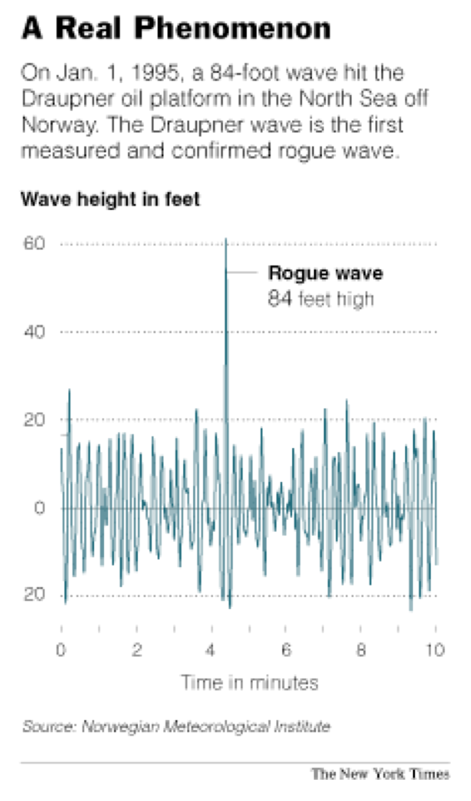
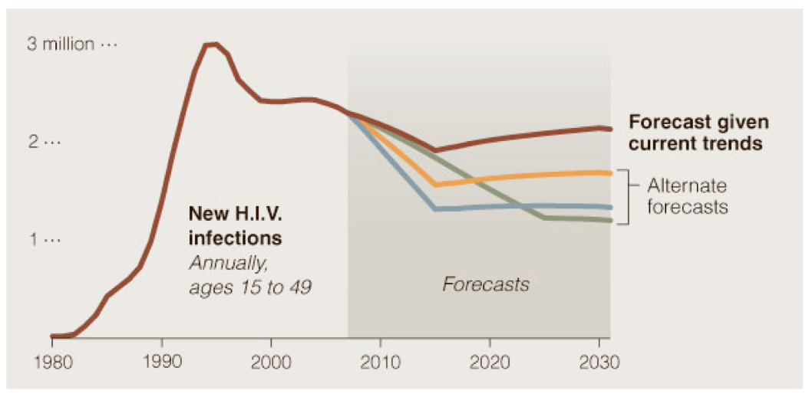
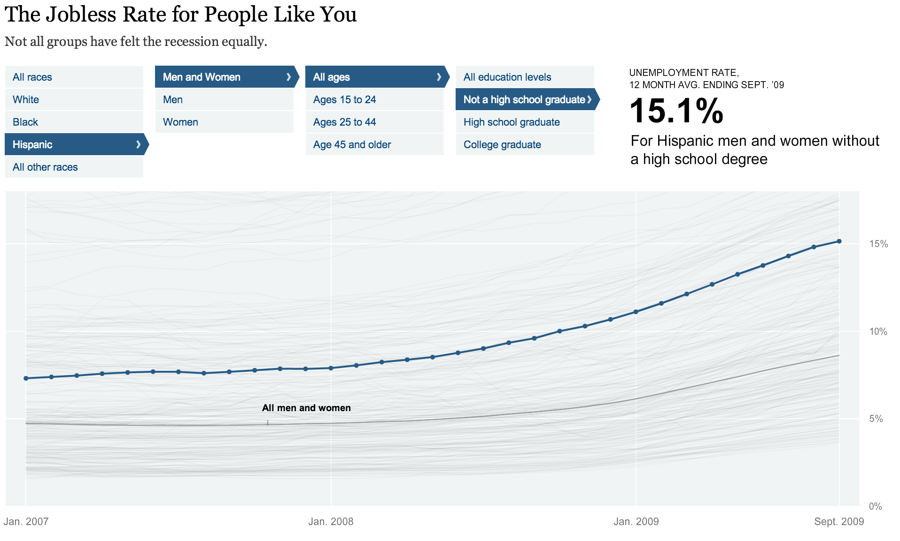
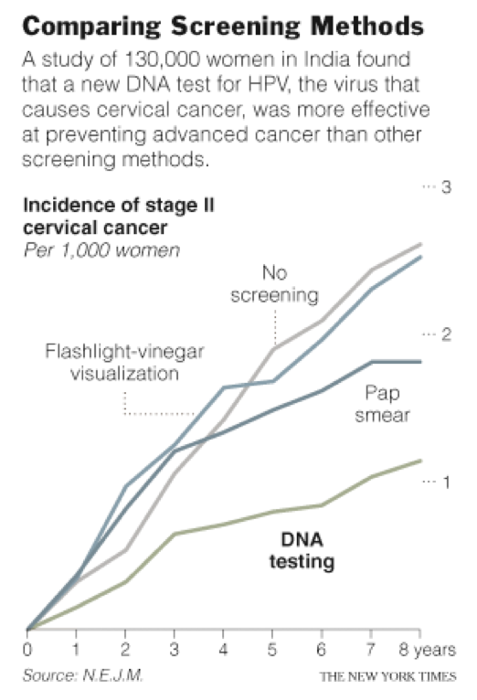
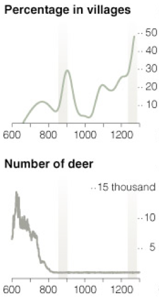
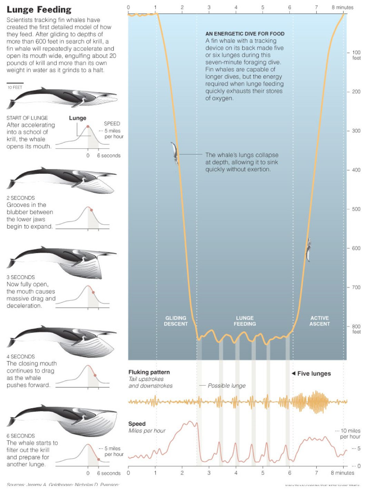
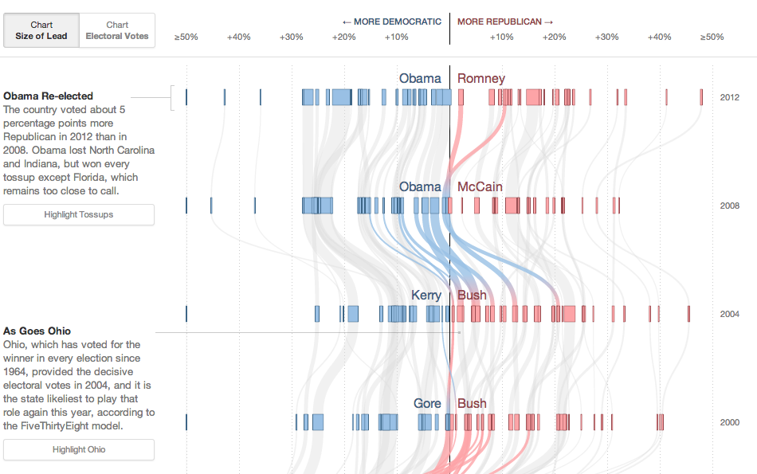
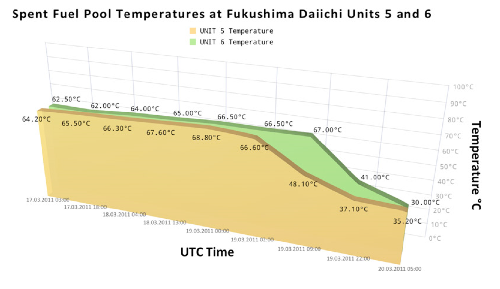

##Basically, use them for anything that has data over time

##Generally better than bar charts if you are trying to show more than two series.

##Especially good if you're trying to show A LOT of groups

##Don't use Legends when they aren't necessary

##Don't use dual axes, instead split up your charts

##Line charts, like all other workhorse forms, can be made sexy

##But they can also be made sexy in bad way

